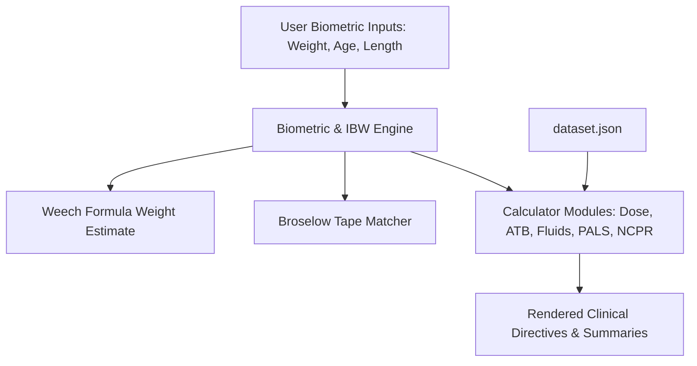

# System Architecture — ER-TSH Pediatric Calculator (ped-tsh)

## Components
1. **Top Navigation & Biometric Bar**:
   - `ABW` (Actual Body Weight in kg)
   - `Age` (Years/Months estimation with Weech formula)
   - `Length` (Length in cm)
   - `IBW` (Ideal Body Weight chip & auto-switch)
   - `Broselow` (Color band estimator & quick reference drawer)

2. **Core Calculators**:
   - `Pediatric Dose`: General pediatric medication dosing, preparation concentration parsing (mg/mL, mg/tab), range checks, per-dose & per-day caps.
   - `Pediatric ATB`: Antibiotic dosing calculator per kg per day or per dose, unit conversions, limits, age & weight warnings.
   - `IV Fluids`: Dehydration assessment (Mild 3-5%, Moderate 6-9%, Severe >=10%), Holliday–Segar maintenance fluid rate calculation, deficit replacement over 24h/48h, ORS vs IV fluid plans.
   - `PALS`: Emergency cardiac arrest protocols (Epi, Amiodarone, Lidocaine, Defib), Bradycardia, Tachycardia (Adenosine, Sync Cardioversion), Torsades MgSO4.
   - `NCPR`: Neonatal resuscitation protocols, Epinephrine IV/IO & ETT dosing, Volume expanders, PPV & FiO2 targets, Hypoglycemia D10W bolus & infusion, ETT & suction catheter sizing.

3. **Data Storage & PWA Service**:
   - `dataset.json`: Single source of truth for drug references, Broselow bands, fluid rules, PALS, and NCPR protocols.
   - `sw.js` & `manifest.webmanifest`: Offline-first caching strategy for instant clinical accessibility without internet.

## Data Flow

## Key Decisions
1. **Single Source of Truth**: All drug guidelines and dosage rules are centralized in `dataset.json` for rapid updating and maintenance.
2. **Offline-First PWA**: Service worker caches static assets (`index.html`, `app.js`, `dataset.json`) to guarantee zero-latency clinical availability in emergency rooms.
3. **No External Framework Dependencies**: Pure Vanilla JS + CSS to minimize bundle size, eliminate build step complexity, and ensure high reliability.
