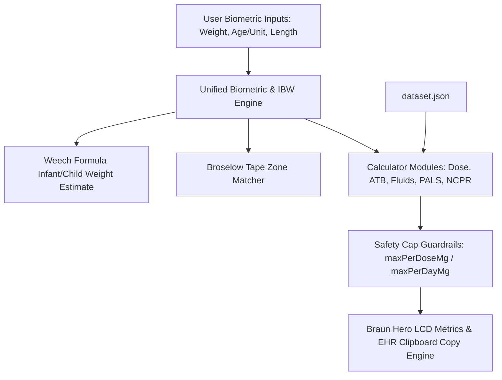

# System Architecture — MNRH ER-PED Calculator (`er-ped`)

## Components
1. **Top Navigation & Unified Biometric Cluster**:
   - `ABW` (Actual Body Weight in kg): Central single source of truth for patient weight across all calculator modules.
   - `Age` & `Unit Switch` (Years/Months toggle with Weech formula: `<1 yr`: `(mo + 9) / 2`, `1–6 yr`: `2 × age + 8`, `>6 yr`: `(7 × age - 5) / 2`).
   - `Length` (Length in cm).
   - `IBW` (Ideal Body Weight chip, Weight-for-Height Broselow tape bands, and auto-switch toggle with input greying/highlighting).
   - `Broselow` (Color band estimator & quick reference drawer).

2. **Core Calculators & Search Interfaces**:
   - `Pediatric Dose`: General pediatric medication dosing with integrated Braun Combobox search, preparation concentration parsing (mg/mL, mg/tab), range checks, per-dose & per-day caps.
   - `Pediatric ATB`: Antibiotic dosing calculator per kg per day or per dose with Braun Combobox search, unit conversions, limits, age & weight warnings.
   - `IV Fluids`: Dehydration assessment (Mild 3–5%, Moderate 6–9%, Severe ≥10%), Holliday–Segar maintenance fluid rate calculation, deficit replacement over 24h/48h, ORS vs IV fluid plans.
   - `PALS`: Emergency cardiac arrest protocols (Epi, Amiodarone, Lidocaine, Defib), Bradycardia, Tachycardia (Adenosine, Sync Cardioversion), Torsades MgSO4, rendered with Braun Hero LCD Metric cards.
   - `NCPR`: Neonatal resuscitation protocols, Epinephrine IV/IO & ETT dosing, Volume expanders, PPV & FiO2 targets, Hypoglycemia D10W bolus & infusion, ETT & suction catheter sizing.

3. **Data Storage, EHR Copy & PWA Service**:
   - `dataset.json`: Single source of truth for drug references, Broselow bands, fluid rules, PALS, and NCPR protocols with safety caps.
   - `EHR Copy Engine`: Formats clean, standardized medical English order lines with one-click clipboard copying (`[ER-PED] Paracetamol 250 mg (10 mL) PO q 6 hr PRN [BW: 16.5 kg]`).
   - `sw.js` & `manifest.webmanifest`: Offline-first caching strategy for instant clinical accessibility without internet.

## Data Flow

## Key Decisions
1. **Braun Design Language & Standalone Architecture**: Standalone clinical web app styled with Braun industrial controls (warm chassis `#F5F4F0`, signal orange `#D9480F`, high-contrast dark graphite) without cross-links to external tools.
2. **Single Source of Truth for Weight**: Topbar ABW automatically syncs weight input to all active modules (`doseWBadge`, `atbWBadge`, `fWBadge`, `pWBadge`), ensuring zero discrepancy during high-stress resuscitations.
3. **Integrated Autocomplete Combobox**: Unified drug search and selection component providing instant keyboard-driven search (`ArrowUp`/`ArrowDown`/`Enter`/`Esc`) and category tagging.
4. **Standardized Medical English EHR Copying**: One-click prescription order formatting in medical English for instant documentation into hospital electronic health records.
5. **Offline-First PWA**: Service worker caches static assets (`index.html`, `app.js`, `dataset.json`) to guarantee zero-latency clinical availability in emergency rooms.
6. **No External Framework Dependencies**: Pure Vanilla JS + CSS to minimize bundle size, eliminate build step complexity, and ensure high reliability.
7. **Strict IBW Scope & State Reset Guardrails**: IBW (Ideal Body Weight) is strictly scoped to weight-for-height calculation when the IBW toggle is active. Turning OFF IBW, entering manual ABW, or typing patient Age resets IBW to `null`, clears length inputs, and resets the IBW chip readout to `—` to eliminate clinician ambiguity.
8. **Bidirectional Age Sync Engine**: Topbar age input and PALS card age input maintain continuous two-way state synchronization, ensuring immediate Weech weight estimation, accurate ETT sizing, and resuscitation dosing across all tabs.

