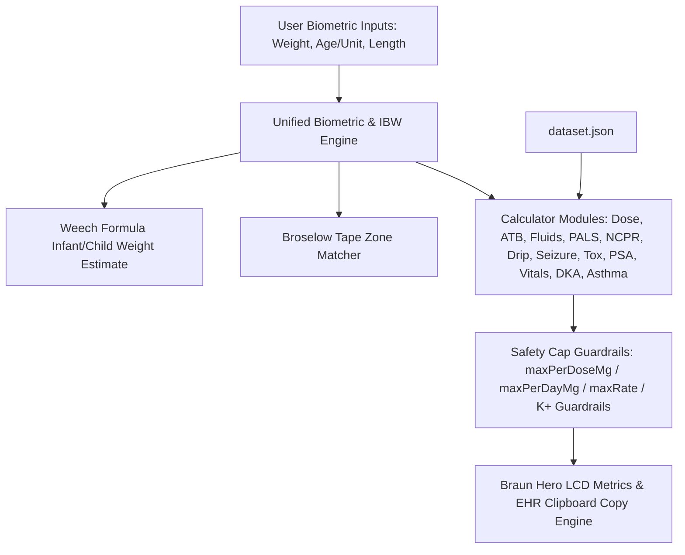

# System Architecture — MNRH ER-PED Calculator (`er-ped`)

## Components
1. **Top Navigation & Three-Zone Biometric Cluster (Measured / Derived / In Use)**:
   - `Measured` section — clinician-entered values only, never programmatically overwritten: `BW` (measured body weight in kg), `Age` placeholder + `yr`/`mo` unit switch button (Weech formula: `<1 yr`: `(mo + 9) / 2`, `1–6 yr`: `2 × age + 8`, `>6 yr`: `(7 × age - 5) / 2`), `HT` (length in cm, always enabled). Grouped visually without redundant textual headers.
   - `Derived` section — read-only computed output: `Wt for Ht` value from Weight-for-Height Broselow tape bands, and explicit `Use Wt-for-Ht` opt-in toggle.
   - `In Use` section (`#activeWeightBox`) — right-aligned, largest type in the topbar. States the weight the dose engine is actually running on plus its provenance and originating input: `10.0 kg` (measured), `Wt for Ht · Wt-for-Ht 100 cm`, `estimated · Weech 4 yr`, or `enter BW or age` when unresolvable.
   - `Minimalist Centered Topbar & Right Action Cluster`: Minimal topbar layout without ER-PED brand badge clutter. Centered cluster houses patient inputs (`BW`, `Age`, `HT`, `Use Wt-for-Ht` switch & display). Right-aligned cluster (`margin-left: auto`) houses reference tools & actions (`Broselow Tape` chip, `Reference 📖▾` icon popover with `Vital Signs by Age` & `Broselow Tape`, `Print`, `TH/EN` language switch, `Light`/`Dark`/`Mono` theme toggle). Main tab bar explicitly splits into Row 1 (`Dose`, `ATB`, `IV Fluids`, `PALS`, `NCPR`, `Drip Rate`) and Row 2 (`Seizure`, `Toxicology`, `Sedation`, `Vitals`, `DKA`).
   - `Language & Print Cluster`: Topbar buttons for Thai/English UI switching (`🌐 TH / EN`) and 1-page reference card printing (`🖨️ Print`).
   - `Module Lock Badges`: Calculator modules (`Dose`, `ATB`, `PALS`, `Drip`) display clean icon-only `🔒` sync badge with `Synced from topbar` tooltip.

2. **Core Calculators & Search Interfaces**:
   - `Pediatric Dose`: General pediatric medication dosing with integrated Braun Combobox search, preparation concentration parsing (mg/mL, mg/tab), range checks, per-dose & per-day caps.
   - `Pediatric ATB`: Antibiotic dosing calculator per kg per day or per dose with Braun Combobox search, unit conversions, limits, age & weight warnings.
   - `IV Fluids`: Dehydration assessment (Mild 3–5%, Moderate 6–9%, Severe ≥10%), Holliday–Segar maintenance fluid rate calculation, deficit replacement over 24h/48h, ORS vs IV fluid plans.
   - `PALS`: Emergency cardiac arrest protocols (Epi, Amiodarone, Lidocaine, Defib), Bradycardia, Tachycardia (Adenosine, Sync Cardioversion), Torsades MgSO4, rendered with Braun Hero LCD Metric cards.
   - `NCPR`: Neonatal resuscitation protocols, Epinephrine IV/IO & ETT dosing, Volume expanders, PPV & FiO2 targets, Hypoglycemia D10W bolus & infusion, ETT & suction catheter sizing.
   - `Drip Rate`: Vasoactive continuous infusion calculator (mcg/kg/min → mL/hr) for Epinephrine, Norepinephrine, Dopamine, Dobutamine, Midazolam, Milrinone with customizable diluent volume.
   - `Seizure Protocol`: Time-phased status epilepticus pathway (0-5m, 5-10m, 10-20m, 20-40m) with weight-based 1st/2nd line ASMs & max cap guardrails.
   - `Toxicology`: Antidote dosing and overdose protocols (Naloxone, Flumazenil, Atropine OP, Activated Charcoal, NAC 3-bag regime).
   - `Sedation (PSA)`: Procedural sedation & analgesia (Ketamine IV/IM, Fentanyl IN/IV, Midazolam IN) with weight-based dosing and safety caps.
   - `Vital Signs`: Age-banded physiological normal ranges (HR, RR, Systolic/Diastolic BP, SpO2) and hypotension cutoffs.
   - `DKA Protocol`: Pediatric DKA fluid management (48h deficit - prior bolus), Regular Insulin drip (0.05-0.1 U/kg/hr), BG < 250 D5W switch alerts, and K+ replacement safety rules.
   - `Asthma Protocol`: Acute asthmatic attack management per GINA 2026 + Thai TAC 2025. 6-stage stepwise protocol (Initial → SABA + Ipratropium + Steroid → HFNC → Reassess → IV MgSO₄ → PICU Escalation) with weight-based drug dosing (mg/kg, mcg/kg, fixed-dose, weight-threshold), HFNC settings calculator (Flow 2 L/kg/min max 60, FiO₂ titration, neb flow reduction), color-coded severity assessment (PRAM), and disposition criteria (Discharge/Admit/PICU).

3. **Data Storage, EHR Copy & PWA Service**:
   - `dataset.json`: Single source of truth for drug references, Broselow bands, fluid rules, PALS, NCPR, Drips, Seizure, Toxicology, PSA, Vital Signs, DKA, and Asthma protocols.
   - `EHR Copy Engine`: Formats clean, standardized medical English order lines with one-click clipboard copying (`[ER-PED DKA] IV 0.9% NS @ 91.7 mL/hr | Regular Insulin Drip @ 2.0 mL/hr [BW: 20.0 kg]`).
   - `sw.js` & `manifest.webmanifest`: Offline-first caching strategy with floating update notification banner (`#pwaUpdateBanner`).
   - `.github/workflows/ci.yml`: GitHub Actions automated dataset validation and core unit testing pipeline.

## Data Flow

## Key Decisions
1. **Braun Industrial Layout & Standalone Architecture** *(superseded palette — see Key Decision #32)*: Standalone clinical web app, originally styled with Braun industrial controls (warm chassis `#F5F4F0`, signal orange `#D9480F`), now on warm ivory (`#F0EEE6`) with muted clay accent (`#A8452A`) and high-contrast graphite ink per Key Decision #32; layout/control conventions (segmented tabs, hero metrics, inset panels) unchanged, without cross-links to external tools.
2. **Single Source of Truth for Weight**: `getWeight()` resolves one authoritative weight, and `getWeightSourceLabel()` resolves its provenance. Both are pushed to all module badges (`doseWBadge`, `atbWBadge`, `fWBadge`, `pWBadge`, `dripWBadge`, `seizureWBadge`, `toxWBadge`, `psaWBadge`, `vitalsWBadge`, `dkaWBadge`, `asthmaWBadge`) as `20.0 kg`, `16.5 kg · Wt for Ht`, or `16.0 kg · est`, ensuring zero discrepancy during high-stress resuscitations.
3. **Integrated Autocomplete Combobox**: Unified drug search and selection component providing instant keyboard-driven search (`ArrowUp`/`ArrowDown`/`Enter`/`Esc`) and category tagging.
4. **EHR Order Engine Retained Without UI Surface**: `copyEHROrder()` and `copyCustomOrder()` remain implemented, exported, and covered by 7 JSDOM tests, but every in-card `Copy` button was removed. The workstation is optimised for reading clinical values at the bedside; order-copy controls consumed roughly a third of each card's height for a workflow not used in practice. Re-exposing copy is a UI-only change — the formatter and its regression coverage are intact.
5. **Offline-First PWA**: Service worker caches static assets (`index.html`, `app.js`, `dataset.json`) with cache-first strategy for static assets and stale-while-revalidate for `dataset.json` (clinical data). Auto-update check every 30 minutes with floating update notification banner (`#pwaUpdateBanner`).
6. **No External Framework Dependencies**: Pure Vanilla JS + CSS to minimize bundle size, eliminate build step complexity, and ensure high reliability.
7. **Non-Destructive Biometric Inputs & Compute/Adopt Separation**: Wt for Ht is COMPUTED whenever `HT > 0` and merely DISPLAYED; the `use for dosing` toggle governs only whether the dose engine ADOPTS it. `updateBiometricUIState()` never writes Wt for Ht back into the `#weight` field — overwriting a clinician's measured weight in place is silent data loss. `HT` is always enabled (a measured biometric, not a mode) and is never cleared by toggling Wt for Ht, entering BW, or entering Age. Entering BW or Age still releases the dose engine from Wt for Ht, but the height reading and Wt for Ht readout survive for comparison.
8. **Bidirectional Age Sync Engine**: Topbar age input and PALS card age input maintain continuous two-way state synchronization, ensuring immediate Weech weight estimation, accurate ETT sizing, and resuscitation dosing across all tabs.
9. **Explicit Active Weight Provenance**: `gWeightSource` tracks whether weight originates from manual measured entry (`'manual'`) or Weech age-based estimation (`'estimated'`). Manual weights are protected from silent overwrite when editing age, with a toast explaining why. `getWeightSourceLabel()` renders the provenance in the `In Use` box together with the originating input value (`estimated · Weech 4 yr`, `Wt for Ht · Wt-for-Ht 100 cm`) so a clinician can audit the number without hunting for another field. Module badges carry the compact suffix (`· Wt for Ht`, `· est`); a measured weight carries no suffix. The box is colour- AND text-differentiated (accent = measured, warning = derived, neutral = empty) to satisfy the monochrome constraint in Key Decision #28.
10. **Robust Clinical Frequency Parser & Composite Token Handling**: `dosesPerDayFromFreq` evaluates regex patterns for `qXh`, `qX-Yh`, `bid`, `tid`, `qid`, `OD`/`once daily`, and `div N`, resolving composite frequencies (e.g. `bid/tid`) to the lower, safer frequency multiplier without returning `null`.
11. **Table-Specific Dosing Semantics & Single-Dose Preservation**: `pediatricATB` numeric fields (`doseMinMgPerKg`/`doseMaxMgPerKg`) are stored as per-dose values directly (verified against clinical notes). Unlike `pediatricDose` (which stores daily totals for `perDay`), `calcATB` and `copyEHROrder('atb')` treat these numeric fields as per-dose targets to prevent clinical underdosing.
12. **Combobox Keyboard Navigation & WAI-ARIA Accessibility**: Search inputs feature full arrow-key (`ArrowUp`/`ArrowDown`), `Enter` selection, and `Escape` dismissal with active option scrolling (`.kb-active`) and screen-reader accessibility tags (`role="combobox"`, `role="listbox"`, `role="option"`, `aria-expanded`).
13. **Automated Dataset Self-Check Tooling**: `scripts/check-dataset.js` validates dataset integrity, checking per-dose vs per-day unit semantics, max daily limits against note text, and verifying 100% schema synchronization between `dataset.json` and `dataset.js`.
14. **Unambiguous Phenytoin Loading vs Maintenance Split**: Phenytoin is structured into two dedicated clinical entries (`phenytoin-iv-load` and `phenytoin-iv-maint`) to prevent single-dose 20 mg/kg loading doses from being multiplied by daily maintenance frequencies.
15. **Age-Gated Weight/Dose Banding Engine**: Dosing brackets (e.g. Oseltamivir, Nystatin, Albendazole) support `fixedDose` and `doseBands` with mandatory age-gating (`minAgeYr: 1.0` for Oseltamivir, 3-tier age/weight gating for Nystatin) to prevent catastrophic 10x overdose in infants under 1 year old.
16. **Recently Used Favorites Engine**: Combobox dropdowns track recently selected drug keys in `localStorage` (`er_ped_recent_doses` / `er_ped_recent_atbs`) and render a top `⭐️ RECENTLY USED` category section when search input is empty.
17. **Renal Dose Adjustment Warning Badges**: High-risk renal clearance agents (Aminoglycosides, Vancomycin, Fluoroquinolones, Acyclovir, Carbapenems) contain `renalAdjust: true` flags, rendering prominent amber `⚠️ ปรับขนาดยาตาม CrCl / eGFR` warnings in metric cards and prescribing directives.
18. **Braun Warm Dark Theme & Grayscale Luminance-Ordered Palette**: Pure CSS custom property theme engine supporting `prefers-color-scheme: dark` and header toggle (`🌙 Dark` / `☀️ Light`) with persistent state in `localStorage` (`er_ped_theme`). Built on zero-blue-cast warm charcoal background (`#171613`), non-glare off-white ink (`#EAE5DB`), and strictly escalating relative luminance ordering (`blue` < `good` < `warning` < `danger`) to guarantee clinical priority discernment on monochrome/grayscale monitors without color halation.
19. **Continuous Infusion Drip Calculation Engine**: Computes infusion pump rates (`mL/hr`) based on `mcg/kg/min`, patient weight (`ABW`), and preparation concentration (`mg in mL`), providing clinical diluent presets (e.g. 1 mg/50 mL, 150 mg/50 mL) and editable concentration fields with rate overflow alerts.
20. **Time-Phased Seizure & Antidote Protocol Pathway**: Timed resuscitation algorithms (0-5m, 5-10m, 10-20m, 20-40m) with automated per-dose calculation, max cap enforcement, and Flumazenil / Phenytoin D5W precipitation contraindication guardrails.
21. **Dual-Exposition Vital Signs Reference**: Renders age-banded normal physiological ranges (HR, RR, BP, SpO2) and hypotension cutoffs (`< 70 + 2×Age` mmHg) both as a standalone table card and as a dynamic inline topbar badge next to age input.
22. **Automated CI Validation & Unit Test Pipeline**: GitHub Actions workflow (`ci.yml`) runs dataset schema integrity validation (`check-dataset.js`) and mathematical unit tests (`test-core.js`) on every push/PR to prevent regression.
23. **Pediatric DKA Protocol Engine & Prior Bolus Subtraction**: Calculates 48-hour fluid deficit replacement subtracted by prior ER boluses, Regular Insulin drip rate (0.05–0.1 U/kg/hr), D5W switching at BG < 250 mg/dL, and potassium replacement safety directives.
24. **Bicultural UI Language Switcher (Thai / English)**: Dual-language header toggle (`🌐 TH` / `🌐 EN`) rendering bilingual labels while maintaining 100% Medical English in EHR order copy strings.
25. **Single-Page A4 Print Engine**: `@media print` hides interactive inputs, navigation chrome (`.tabs`), overlays, and floating controls, emitting only the ACTIVE tabpanel. Root cause of the previous 5-page output: `.card { display: block !important; }` overrode the inline `display:none` on the 10 inactive `section[role="tabpanel"]` elements, resurrecting every module at print time. Fixed by dropping the blanket `display:block` and adding explicit `section[role="tabpanel"][style*="display:none"] { display: none !important; }`, plus `@page { size: A4; margin: 10mm; }` and `break-inside: avoid` on `.hero-metric`/`tr`/`.summary`. Verified 2026-07-28: `chrome --headless --print-to-pdf` + `pdfinfo` → **1 page, 594.96 × 841.92 pts (A4)**, clinical content confirmed present via `pdftotext`.
26. **Lightweight Dataset Editor & Local Overrides**: Browser-based dataset customization drawer allowing clinicians to edit max caps and drug notes saved to `localStorage` with JSON export and master reset capability.
27. **Zero-Conflict Alt Shortcuts, Structured 2-Row Nav Layout, & Non-Disruptive Page Scrolling**: Navigation tab bar explicitly groups modules into 2 structured rows: Row 1 (Dose, ATB, IV Fluids, PALS, NCPR, Drip Rate) and Row 2 (Seizure, Toxicology, Sedation, Vitals, DKA, Asthma). PALS tab auto-scrolling is disabled to maintain non-disruptive, top-of-page alignment across all tabs. Keyboard shortcuts remain mapped (`Alt+1`..`Alt+0`, `Alt+K`, `Alt+A`), preserving instant clinician navigation.
28. **Monochrome Palette & Portrait ED Display Optimization**: Enforces luminance-ordered theme via CSS custom properties on grayscale/monochrome displays regardless of OS dark mode reporting. Hero metric labels feature shape-coded prefix symbols (`✓`, `▲`, `✕`, `ℹ`) via CSS `::before` pseudo-elements for non-color-dependent severity recognition. Dedicated portrait media query (`@media (orientation: portrait) and (min-width: 700px) and (max-width: 900px)`) folds topbar vertically, uses a 6-column grid (2-column hero metrics), 44px touch targets, 8px metric borders, and 16px base font size for distance viewing on ~800×1200 CSS px portrait ER display panels.
29. **Structured Laxative & Antacid Dosing with Safety Caps & Dual PEG Entries**: Alum milk suspension, Lactulose syrup, and Polyethylene Glycol (PEG) are structured into per-kg dose fields (`doseMinMgPerKg`/`doseMaxMgPerKg`) with per-dose (`maxPerDoseMg`) and daily (`maxPerDayMg`) safety caps. PEG (Forlax) is explicitly split into dedicated clinical entries (`peg-forlax-10g-sachet-disimpaction` and `peg-forlax-10g-sachet-maint`) to support both acute ED fecal disimpaction (`1 g/kg/day`) and outpatient maintenance (`0.5–1 g/kg/day`) without manual math risks.
30. **Design Mockup v2 Refinements & Mono Safety Indicators**: Resolves CSS syntax formatting and duplicate selector blocks in `design-mockup-v2.html`. Implements a dynamic mock drug dataset (`paracetamol`, `ibuprofen`, `amoxicillin`, `ondansetron`, `salbutamol`, `diazepam`) for quick-grid recalculations with interactive dose, volume, verification math, and EHR copy strings. Adds dedicated prototype placeholder screens for `Drip` (vasopressor infusion mockup) and `Vitals` (age-adjusted vital signs reference) to avoid tab mapping ambiguity. Enforces non-color-dependent visual safety in monochrome theme via text-style Unicode glyphs with VS15 selector (`\2713\FE0E` `✓`, `\25B2\FE0E` `▲`, `\2716\FE0E` `✕`) and double-border styling for `.tag.warn`, ensuring zero color emoji rendering and 100% hue-free presentation on monochrome ED panels.
31. **Design Mockup v2 Integration & PR#1 Quality Fixes**: Merges design tokens from `design-mockup-v2.html` into `index.html`. Expands theme engine to 3-state cycle (`Light` → `Dark` → `Mono`) with persistent state in `localStorage` (`er_ped_theme`) and real-time Broselow chip/swatch palette re-rendering. Implements 2-row topbar with decluttered `Reference 📖▾` popover and `⋯` Overflow menu (`Print` / `Language`). Consolidates Broselow color palette into a single authoritative dictionary (`BROSELOW_COLOR_MAP`). Removes duplicate `initTheme()` hoisting conflict and invalid `(monochrome)` media query. Groups navigation tabs into 2 visual `.tabs` rows within a single outer `role="tablist"` container (`Clinical Calculators & Protocols`) with explicit `Alt+1`..`Alt+0` + `Alt+K` keyboard shortcuts, `type="button"` attributes, complete WAI-ARIA tablist/tabpanel semantics (`role="tab"`, `role="tabpanel"`, `aria-selected`, `aria-controls`), and CSS `--blue` alias linked to `--accent2`.

32. **Anthropic-Derived Reading-First Design Language & Card Densification**: Palette moved to warm ivory (`--bg: #F0EEE6`, `--card: #FBFAF7`) with a muted clay accent (`--accent: #A8452A` light / `#DE9070` dark), replacing the higher-chroma signal orange. Drop shadows removed (`--shadow-1: none`, `.card`/`.hero-metric` flat) so borders alone carry hierarchy. Module headings (`h1`, `h2`) use a serif display face (`Newsreader`, `--font-display`) against the Sarabun body sans. Density is deliberately INVERTED from Anthropic's marketing-site whitespace: card padding `20px → 14px 16px`, hero-metric padding `12px 16px → 9px 12px`, hero grid gap `12px → 8px`, container widened `1040px → 1180px`. Rationale: the site's calm comes from removing elements, not from spacing them apart — a bedside clinical tool must maximise data per screen. Verified: all 11 cards above the fold at 1440×950, document height reduced 944px → 903px.

33. **Measured Topbar Clearance (`--topbar-h`)**: The fixed topbar's height varies from 135px (desktop) to 219px (portrait ED panel) as the biometric groups wrap. `syncTopbarHeight()` measures the bar via `ResizeObserver` (plus a `document.fonts.ready` pass, since webfonts land after first paint) and publishes `--topbar-h` on `:root`; every `.container` margin is `calc(var(--topbar-h, 140px) + 12px)`. Replaces hardcoded `98px`/`120px`/`130px` margins which occluded page content behind the topbar on EVERY viewport under 900px (measured overlap up to 155px). Portrait ED panels additionally use `flex: 1 1 auto` (2-up) rather than `1 1 100%` on `.bio-group`, cutting the topbar from 285px to 219px on an 800×1200 panel. Verified clear at 1440/1180/900/800/700/430/380px.

34. **Global Toggle Switch & WCAG 2.5.8 Hit Areas**: `.switch` styling is global rather than scoped to `.chip`, so the `use for dosing` control in the biometric cluster renders as a real slider (34×24px, pill track, clay fill when ON) instead of a native checkbox. The knob stays visually 18px while `padding` + `background-clip: content-box` extend the hit area to the 24px WCAG 2.5.8 minimum for gloved use; `.unit-toggle-btn` gets `min-height: 26px`. `.bio-use-toggle:has(.switch:checked)` recolours the label so active state is conveyed by weight and colour together, satisfying the monochrome constraint in Key Decision #28.
35. **15-Year Pediatric Age Ceiling Guardrail**: Enforces a strict maximum pediatric age ceiling of 15 years (180 months) across topbar biometrics, PALS inputs, Weech weight estimation, and vital signs reference. Inputs exceeding 15 years are auto-clamped with an explicit clinical toast alert (`จำกัดอายุสูงสุดไม่เกิน 15 ปี (Pediatric Limit 15 Years)`) to prevent accidental adult dosing calculations in a pediatric ER workstation.
36. **Monochrome High-Contrast Tonal Inversion Engine**: On monochrome hospital displays (`data-theme="mono"`), color hues are unavailable to signal active or focused states. Active controls (`.tab-btn.active`, `.pill.active`, `.btn-primary`) and search combobox selections (`.combobox-item:hover`, `.combobox-item.selected`, `.combobox-item.kb-active`) apply high-contrast tonal inversion (`#EAEAE6` bright background with `#121210` dark graphite text and `#FFFFFF` 2px outline), guaranteeing > 14:1 contrast ratio and eliminating low-contrast white-on-white text issues on hospital panels.
37. **Universal Input & Selection Box Contrast Engine**: All form controls (`input`, `select`, `.combobox-input`, `option`, `.combobox-dropdown`, `.chip input`) utilize dynamic theme custom properties (`var(--card)` / `var(--ink)`) for default and focused states, with explicit theme-scoped overrides in Dark (`#2E2B26` background, `#FFFFFF` text) and Mono (`#2A2A28` background, `#FFFFFF` text, `#EAEAE6` border). Replaces hardcoded light focus backgrounds, eliminating white-on-white text collisions across all 11 workstation module tabs.
38. **Minimal Visual Design Refactor & Inline Lucide SVG Icon System (v1.5.0)**: Transitioned from the tactile "Braun industrial control chassis" aesthetic to a low-decoration, flat visual interface. Collapsed redundant semantic color aliases (`--accent2`, `--blue` merged into `--ink`/`--accent`), reduced surface shadows to near-zero (`none` for in-flow cards/tabs/inputs, `0 1px 2px` max for floating popovers/drawers), replaced segmented radio button tabs with Flat Underline Tabs (`border-bottom: 2px solid var(--accent)`), and simplified Hero Metric blocks. Replaced all live-UI text emoji glyphs with inline Lucide SVG icons (`currentColor`, `stroke-width="2"`, `aria-hidden="true"`), eliminating browser font emoji rendering variability while preserving offline PWA operation and historical release notes in changelogs. Service worker cache version bumped to `er-ped-v1.5.0-20260729`.
39. **Compact Protocol UI Streamlining & De-nested Layout (v1.5.1)**: Refactored output layout in `Seizure Protocol`, `Drip Rate`, `Toxicology`, `Procedural Sedation (PSA)`, and `DKA Protocol` tabs to eliminate redundant multi-level card borders (nested cards in cards). Relocated clinical alert/summary note callout banners to top of module section cards above outputs for immediate bedside triage visibility. Service worker cache version bumped to `er-ped-v1.5.1-20260729`.
40. **High-Density Compact Protocol Table Layout (v1.5.2)**: Converted drug grid cards in `Seizure Protocol`, `Toxicology`, and `Procedural Sedation (PSA)` to zero-shadow, high-density HTML tables with clean column headers (`Medication`, `Dose (Calculated)`, `Prep Concentration`, `Clinical Note`). Reduced vertical height by >65%, eliminating page scrolling on standard ED display workstation viewports and allowing all resuscitation stages to fit above the fold. Service worker cache version bumped to `er-ped-v1.5.2-20260729`.
41. **Universal Protocol Tables & Project Origination Credit (v1.5.3)**: Expanded high-density compact HTML table layouts across `Drip Rate` and `DKA Protocol` modules, bringing uniform table rendering to all 5 resuscitation protocol tabs (`Seizure`, `Drip Rate`, `Toxicology`, `Sedation (PSA)`, `DKA`). Added explicit footer credit badge and modal dialog (`#attributionBackdrop` / `openAttributionModal()`) explicitly attributing project origination to `https://ped-tsh.web.app/`. Service worker cache version bumped to `er-ped-v1.5.3-20260729`.
42. **Whitespace Optimization & Nested Container Elimination (v1.5.4)**: Refactored `.summary` CSS class to render transparently without secondary card borders or internal padding, eliminating double-bordered box containers around protocol tables across all modules (`Seizure`, `Toxicology`, `Sedation`, `DKA`, `Vitals`). Reduced table cell padding from `6px 8px` to `4px 6px`, tightened table line-height to `1.3`, and reduced stage block vertical margins, shrinking module vertical footprint by >50% and eliminating empty whitespace around tables. Service worker cache version bumped to `er-ped-v1.5.4-20260729`.
43. **Broselow Decimal Weight Boundary Fix (v1.5.5)**: Updated `max` boundaries across all Broselow tape weight ranges in `dataset.json` and `dataset.js` (`Grey: 3–5.9`, `Pink: 6–7.9`, `Red: 8–9.9`, `Purple: 10–11.9`, `Yellow: 12–14.9`, `White: 15–18.9`, `Blue: 19–23.9`, `Orange: 24–29.9`, `Green: 30–36`). This eliminates integer boundary gaps (such as 9.1–9.9 kg for Red zone) and guarantees 100% Broselow zone matching for all float weight inputs. Service worker cache version bumped to `er-ped-v1.5.5-20260729`.
44. **Minimal Design System Consistency & Icon Alignment (v1.5.6)**: Replaced all raw inline emoji glyphs (`💡`, `🏥`, `🌐`, `ℹ️`) across Live UI note callouts (Drip, Seizure, Toxicology, Sedation, DKA) and footer/attribution dialogs with cohesive Lucide SVG icons. Flattened nested bordered box container in Project Origination & Attribution Credit drawer modal to maintain clean single-container panel hierarchy. Service worker cache version bumped to `er-ped-v1.5.6-20260730`.
46. **Zero-CLS Mobile Tab Rail, WCAG AA Contrast & Responsive UI Upgrade (v1.6.0)**: Overhauled mobile and desktop UI/UX:
    - **Zero-CLS Mobile Tab Navigation**: Removed dynamic label hiding on inactive mobile tabs (`.tab-btn .tab-label { display: none; }` -> persistent `display: inline !important;`). Converted tab navigation into a horizontal smooth-scrolling rail with active tab auto-scrolling (`btn.scrollIntoView({ inline: 'center', behavior: 'smooth' })`), completely eliminating Cumulative Layout Shift (CLS).
    - **WCAG 2.1 Contrast Compliance**: Raised secondary text (`--muted`) to `#57534E` (> 4.8:1 contrast on `#FBFAF7`) and fixed hero metric sub-labels and unit colors. Replaced hardcoded `#FFFFFF` drawer background with `var(--card)` to prevent blinding white flashes in Dark and Mono themes.
    - **Combobox Quick-Clear Buttons**: Added touch-friendly quick-clear buttons (`✕`) to `doseSearch` and `atbSearch` combobox inputs for rapid clearing in emergency triage.
    - **iOS Auto-Zoom Prevention**: Set font size on all form inputs and chips to `16px` on mobile viewports (< 768px), preventing iOS Safari auto-zooming on focus.
    - **Responsive Protocol Tables & Dose Badges**: Implemented `.protocol-table-wrapper` and `.dose-badge` classes across Drip, Seizure, Tox, PSA, Vitals, DKA, and Broselow equipment drawers for uniform high-density rendering on any viewport width.
47. **Comprehensive UI/UX Ergonomics, Sticky Data Grids & Interactive Spectrum Engine (v1.7.0)**: Complete overhaul of clinical bedside ergonomics across desktop and mobile form factors:
    - **Adaptive 2-Column Mobile Topbar Grid**: Converted mobile patient biometric bar into an adaptive 2x2 grid layout (Measured BW col 1, In-Use Active Weight col 2, Derived Height/IBW full-width col 2). Guarantees the critical active weight box is immediately visible without horizontal scrolling on 320–480px screens.
    - **Category Jump Rail & Quick Navigation**: Added `.category-bar` semantic jump pills (🌟 *All Modules*, ⚡ *Emergency Resus*, 💊 *Meds & Fluids*, 🩺 *Protocols & Vitals*) to instantly filter and navigate the 11 clinical tabs with zero cognitive friction.
    - **Sticky First-Column Protocol Tables & Zebra Striping**: Implemented `position: sticky; left: 0` for table headers and first columns on all `.protocol-table` data grids with subtle alternating row striping (`color-mix`), ensuring drug names remain locked in view during horizontal scrolling on small mobile screens.
    - **Interactive Broselow 9-Band Color Spectrum Bar**: Replaced static text drawer header with an interactive 9-band visual color spectrum bar (Grey → Pink → Red → Purple → Yellow → White → Blue → Orange → Green) showing the active patient zone, with 1-tap zone previewing (`previewBroselowZone`).
    - **Search Query Substring Highlighting & Category Quick-Filters**: Integrated XSS-safe `<mark class="search-match">` query highlighting and Category Filter Pills (`Antipyretic`, `Respiratory`, `GI`, `Steroid`, `Anticonvulsant`, `Penicillin`, `IV Resus`, `Macrolide`, `Aminoglycoside`) for rapid bedside medication selection.
    - **Tactile Feedback & Accessible Focus States**: Added `:focus-visible` offset rings (3px outline with 2px offset) and `:active { transform: scale(0.97); }` compression states across all interactive buttons, pills, and tabs for physical confirmation when operating under gloved ED conditions.
    - Service worker cache version bumped to `er-ped-v1.7.0-20260815`.
48. **Acute Asthmatic Attack Protocol with HFNC Calculator (v1.8.0)**: Added 12th clinical module — Acute Asthma Management per GINA 2026 (May 2026 release) and Thai Asthma Council (TAC พ.ศ. 2568):
    - **6-Stage Stepwise Protocol**: Initial Assessment (Epi IM first if anaphylaxis per GINA 2026) → First-Line SABA + Ipratropium + Steroid → HFNC Consideration → Reassess Response → IV MgSO₄ Escalation (nebulized MgSO₄ removed per GINA 2026) → Life-Threatening / PICU Escalation (Terbutaline IV).
    - **HFNC Settings Calculator**: Weight-based auto-calculation: Flow Rate 2 L/kg/min (range 1–2, max 60 L/min), FiO₂ starting 40% titrating to SpO₂ ≥ 92%, Temperature 37°C, NEB during HFNC ≤ 0.25 L/kg/min (max 10 L/min).
    - **Multi-Mode Drug Dosing Engine**: Handles standard mg/kg (Salbutamol, Prednisolone, Dexamethasone, Hydrocortisone, MgSO₄, Epinephrine), mcg/kg (Terbutaline IV), fixed-dose (Salbutamol pMDI puffs), and weight-threshold (Ipratropium <20kg / ≥20kg) with min-dose floors, max-dose caps, and visual warning badges.
    - **Color-Coded Severity Assessment**: GINA 2026 severity criteria table (Speech, SpO₂, Alertness, RR, Accessory Muscles, PRAM Score) with green/yellow/red column headers for Mild–Moderate, Severe, and Life-Threatening.
    - **Disposition Criteria Cards**: 3-column responsive grid (Discharge ✅, Admit Ward 🔶, PICU 🚨) with clinical criteria checklists.
    - `calcAsthma()` registered in `showTab()`, `calcAll()`, `setupKeyboardShortcuts()` (`Alt+A`), and weight badge propagation array.
    - Service worker cache version bumped to `er-ped-v1.8.0-20260818`.
49. **DOM Synchronization, Print Isolation & Clinical Calculation Hardening (v1.8.1)**: Comprehensive audit & cleanup:
    - Added `#a2hsBtn` inside overflow popover menu for native PWA `beforeinstallprompt` installation workflow.
    - Added `#vitalsQuickText` in Vital Signs module header card for live HR/RR physiological readout.
    - Removed dead CSS `.nav-break` and simplified `suggestBlade(kg)` signature by dropping unused `age` parameter.
    - Hardened `calcDrip()` calculation against zero/negative diluent volume divisions.
    - Upgraded `@media print` tabpanel isolation to use dynamic `.active-panel` CSS class toggling in `showTab()`, preventing inactive tab dump.
    - Elevated `.drawer-backdrop` Z-index to `300` to guarantee modal overlay priority over dropdowns (`z-index: 100`).
    - Expanded automated unit test suite (`scripts/test-core.js`) from 43 to 51 tests covering direct DKA, Drip, Airway sizing, and zero-weight edge cases.
    - Service worker cache version bumped to `er-ped-v1.8.1-20260819`.
50. **Version Auto-Sync from `sw.js` CACHE_NAME / Cache API**:
    - Implemented dynamic version extraction (`syncVersionFromSW()`) and DOM binding (`applyVersionToUI(versionStr)`).
    - Offline mode: Automatically parses and sorts `caches.keys()`, matching the latest `er-ped-v*` cache partition.
    - Online mode: Direct un-cached fetch of `sw.js` (`{ cache: 'no-cache' }`) to parse `CACHE_NAME` constant on initial boot and SW update events.
    - Dynamically binds `#footerVersionChip` (`v1.8.1`), `#changelogVersionNumber` (`1.8.1`), `#changelogWhatsNewVersion` (`1.8.1`), and all `.app-version-val` elements.
    - Service worker cache version bumped to `er-ped-v1.8.1-20260819`.
51. **Simple & Elegant Visual & Design System Overhaul (v1.9.0)**:
    - **Refined Color Tokens & Soft Micro-Elevation**: Upgraded light theme background to warm organic sand (`#F6F5F0`), elevated crisp white cards (`#FFFFFF`), warm terracotta accent (`#9E3D24`), and soft tinted container backgrounds (`#FBECE7`, `#F5DCD4`). Dark theme calibrated with deep warm obsidian chassis (`#12110F`) and slate card surfaces (`#1C1A17`). Added 3-tier micro-elevation shadow tokens (`--shadow-1`, `--shadow-2`, `--shadow-3`) and a unified border radius scale (`--r-xs` through `--r-xl`).
    - **Dual-Channel Shape-Coded Hero Dosage Metrics**: Updated `.hero-metric` digital dosage cards with shape-coded status prefixes (`✓` safe, `▲` warning, `✕` danger, `ℹ` info) ensuring dual-channel accessibility for color-blind clinicians under high-stress ER lighting.
    - **Universal Inline Lucide SVG Icon System**: Replaced all raw live-UI text emojis across navigation category pills, drug cards, protocol headers, dosage alerts, and modal panels with lightweight inline Lucide SVGs, guaranteeing uniform visual rendering across iOS, Android, and desktop browsers.
    - **High-Density Protocol Tables & Modals**: Enhanced `.protocol-table` layouts with sticky first column (`position: sticky; left: 0`), subtle `color-mix` zebra striping, and refined drawer modals (`border-radius: 18px 18px 0 0` on mobile) for Broselow tape and changelog views.
    - Service worker cache version bumped to `er-ped-v1.9.0-20260820`.
52. **UI/UX Simplification, De-Cluttering & Bedside Ergonomics (v1.9.2)**:
    - **Single Source of Truth Topbar**: De-duplicated repetitive `.weight-lock-chip` form rows from general calculator cards (Dose, ATB, Fluids, PALS, Drip), delegating weight display to the persistent sticky header biometrics capsule, freeing 40–60px of vertical space for clinical calculation readouts.
    - **Warm Organic Ivory & Micro-Elevation**: Unified color tokens with soothing warm ivory canvas (`#F7F6F2`), crisp elevated white cards (`#FFFFFF`), refined terracotta accent (`#9E3D24`), and soft diffused ambient shadows.
    - **Ergonomic Bedside Grid Alignment**: Cleaned form inputs across modules (e.g. Drip continuous infusion aligned to a neat 3-column row: Target Dose, Drug Amount, Diluent Volume).
    - **Hospital Display & Mobile Hardening**: Configured 16px input font size to prevent iOS Safari auto-zoom, ensured touch targets meet WCAG standards, and optimized Monochrome theme for hospital display panels.
    - Service worker cache version bumped to `er-ped-v1.9.2-20260821`.

53. **Deep Audit Surgical Cleanups & NCPR Blood Glucose Integration (v1.9.2)**:
    - **Universal Single Source of Truth**: Completed full de-cluttering across all 11 modules (removing legacy badges and placeholder nodes), anchoring weight awareness to the sticky topbar capsule.
    - **NCPR Blood Glucose Reactivity**: Wired `#nBG` input to provide dynamic bedside hypoglycemia alerts (`< 40 mg/dL`), normoglycemia status (`≥ 40 mg/dL`), and calculated D10W bolus & infusion rates.
    - **Dead Code & Token Pruning**: Eliminated dead `copyCustomOrder()` routine and pruned unused CSS custom properties.
    - **Metadata & Fallback Alignment**: Synchronized `package.json` version, theme-color meta tag (`#9E3D24`), inline favicon fill, and static HTML fallbacks to `1.9.2`.
    - **Automated Verification**: Expanded test suite in `scripts/test-core.js` to 54 passing tests.

