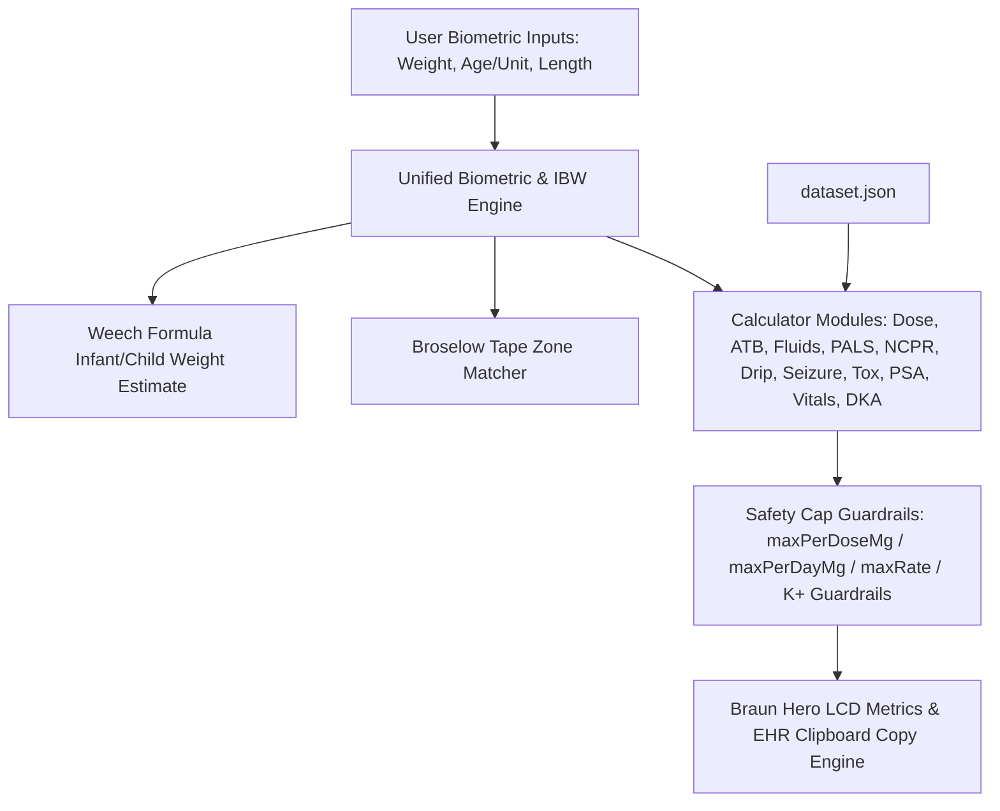

# System Architecture — MNRH ER-PED Calculator (`er-ped`)

## Components
1. **Top Navigation & Unified Biometric Cluster**:
   - `ABW` (Actual Body Weight in kg): Central single source of truth for patient weight across all calculator modules.
   - `Age` & `Unit Switch` (Years/Months toggle with Weech formula: `<1 yr`: `(mo + 9) / 2`, `1–6 yr`: `2 × age + 8`, `>6 yr`: `(7 × age - 5) / 2`).
   - `Length` (Length in cm).
   - `IBW` (Ideal Body Weight chip, Weight-for-Height Broselow tape bands, and auto-switch toggle with input greying/highlighting).
   - `Minimalist Centered Topbar & Right Action Cluster`: Minimal topbar layout without ER-PED brand badge clutter. Centered cluster houses patient inputs (`ABW`, `Age`, `HT`, `IBW` switch & display). Right-aligned cluster (`margin-left: auto`) houses reference tools & actions (`Vital Signs` quick chip, `Broselow` tape chip, `Print`, `TH/EN` language, `Dark/Light` theme toggle). Main tab bar explicitly splits into Row 1 (`Dose`, `ATB`, `IV Fluids`, `PALS`, `NCPR`, `Drip Rate`) and Row 2 (`Seizure`, `Toxicology`, `Sedation`, `Vitals`, `DKA`).
   - `Language & Print Cluster`: Topbar buttons for Thai/English UI switching (`🌐 TH` / `🌐 EN`) and 1-page reference card printing (`🖨️ Print`).

2. **Core Calculators & Search Interfaces**:
   - `Pediatric Dose`: General pediatric medication dosing with integrated Braun Combobox search, preparation concentration parsing (mg/mL, mg/tab), range checks, per-dose & per-day caps.
   - `Pediatric ATB`: Antibiotic dosing calculator per kg per day or per dose with Braun Combobox search, unit conversions, limits, age & weight warnings.
   - `IV Fluids`: Dehydration assessment (Mild 3–5%, Moderate 6–9%, Severe ≥10%), Holliday–Segar maintenance fluid rate calculation, deficit replacement over 24h/48h, ORS vs IV fluid plans.
   - `PALS`: Emergency cardiac arrest protocols (Epi, Amiodarone, Lidocaine, Defib), Bradycardia, Tachycardia (Adenosine, Sync Cardioversion), Torsades MgSO4, rendered with Braun Hero LCD Metric cards.
   - `NCPR`: Neonatal resuscitation protocols, Epinephrine IV/IO & ETT dosing, Volume expanders, PPV & FiO2 targets, Hypoglycemia D10W bolus & infusion, ETT & suction catheter sizing.
   - `Drip Rate`: Vasoactive continuous infusion calculator (mcg/kg/min → mL/hr) for Epinephrine, Norepinephrine, Dopamine, Dobutamine, Midazolam, Milrinone with customizable diluent volume.
   - `Seizure Protocol`: Time-phased status epilepticus pathway (0-5m, 5-10m, 10-20m, 20-40m) with weight-based 1st/2nd line ASMs & max cap guardrails.
   - `Toxicology`: Antidote dosing and overdose protocols (Naloxone, Flumazenil, Atropine OP, Activated Charcoal, NAC 3-bag regime).
   - `Sedation (PSA)`: Procedural sedation & analgesia (Ketamine IV/IM, Fentanyl IN/IV, Midazolam IN) with weight-based dosing and safety caps.
   - `Vital Signs`: Age-banded physiological normal ranges (HR, RR, Systolic/Diastolic BP, SpO2) and hypotension cutoffs.
   - `DKA Protocol`: Pediatric DKA fluid management (48h deficit - prior bolus), Regular Insulin drip (0.05-0.1 U/kg/hr), BG < 250 D5W switch alerts, and K+ replacement safety rules.

3. **Data Storage, EHR Copy & PWA Service**:
   - `dataset.json`: Single source of truth for drug references, Broselow bands, fluid rules, PALS, NCPR, Drips, Seizure, Toxicology, PSA, Vital Signs, and DKA protocols.
   - `EHR Copy Engine`: Formats clean, standardized medical English order lines with one-click clipboard copying (`[ER-PED DKA] IV 0.9% NS @ 91.7 mL/hr | Regular Insulin Drip @ 2.0 mL/hr [BW: 20.0 kg]`).
   - `sw.js` & `manifest.webmanifest`: Offline-first caching strategy with floating update notification banner (`#pwaUpdateBanner`).
   - `.github/workflows/ci.yml`: GitHub Actions automated dataset validation and core unit testing pipeline.

## Data Flow

## Key Decisions
1. **Braun Design Language & Standalone Architecture**: Standalone clinical web app styled with Braun industrial controls (warm chassis `#F5F4F0`, signal orange `#D9480F`, high-contrast dark graphite) without cross-links to external tools.
2. **Single Source of Truth for Weight**: Topbar ABW automatically syncs weight input to all active modules (`doseWBadge`, `atbWBadge`, `fWBadge`, `pWBadge`, `dripWBadge`, `seizureWBadge`, `toxWBadge`, `psaWBadge`, `vitalsWBadge`, `dkaWBadge`), ensuring zero discrepancy during high-stress resuscitations.
3. **Integrated Autocomplete Combobox**: Unified drug search and selection component providing instant keyboard-driven search (`ArrowUp`/`ArrowDown`/`Enter`/`Esc`) and category tagging.
4. **Standardized Medical English EHR Copying**: One-click prescription order formatting in medical English for instant documentation into hospital electronic health records.
5. **Offline-First PWA**: Service worker caches static assets (`index.html`, `app.js`, `dataset.json`) with cache-first strategy for static assets and stale-while-revalidate for `dataset.json` (clinical data). Auto-update check every 30 minutes with floating update notification banner (`#pwaUpdateBanner`).
6. **No External Framework Dependencies**: Pure Vanilla JS + CSS to minimize bundle size, eliminate build step complexity, and ensure high reliability.
7. **Strict IBW Scope & State Reset Guardrails**: IBW (Ideal Body Weight) is strictly scoped to weight-for-height calculation when the IBW toggle is active. Turning OFF IBW, entering manual ABW, or typing patient Age resets IBW to `null`, clears length inputs, and resets the IBW chip readout to `—` to eliminate clinician ambiguity.
8. **Bidirectional Age Sync Engine**: Topbar age input and PALS card age input maintain continuous two-way state synchronization, ensuring immediate Weech weight estimation, accurate ETT sizing, and resuscitation dosing across all tabs.
9. **Biometric Weight Source Tracking & Manual Weight Protection**: `gWeightSource` tracks whether patient weight originates from manual measured entry (`'manual'`) or Weech age-based formula estimation (`'estimated'`). Manual weights are protected from silent overwrite when entering or entering/editing patient age, displaying an explicit user toast notification. When weight is estimated, all module weight badges display a persistent `(est.)` indicator (`14.0 kg (est.)`) to clearly distinguish estimated values from measured weights.
10. **Robust Clinical Frequency Parser & Composite Token Handling**: `dosesPerDayFromFreq` evaluates regex patterns for `qXh`, `qX-Yh`, `bid`, `tid`, `qid`, `OD`/`once daily`, and `div N`, resolving composite frequencies (e.g. `bid/tid`) to the lower, safer frequency multiplier without returning `null`.
11. **Table-Specific Dosing Semantics & Single-Dose Preservation**: `pediatricATB` numeric fields (`doseMinMgPerKg`/`doseMaxMgPerKg`) are stored as per-dose values directly (verified against clinical notes). Unlike `pediatricDose` (which stores daily totals for `perDay`), `calcATB` and `copyEHROrder('atb')` treat these numeric fields as per-dose targets to prevent clinical underdosing.
12. **Combobox Keyboard Navigation & WAI-ARIA Accessibility**: Search inputs feature full arrow-key (`ArrowUp`/`ArrowDown`), `Enter` selection, and `Escape` dismissal with active option scrolling (`.kb-active`) and screen-reader accessibility tags (`role="combobox"`, `role="listbox"`, `role="option"`, `aria-expanded`).
13. **Automated Dataset Self-Check Tooling**: `scripts/check-dataset.js` validates dataset integrity, checking per-dose vs per-day unit semantics, max daily limits against note text, and verifying 100% schema synchronization between `dataset.json` and `dataset.js`.
14. **Unambiguous Phenytoin Loading vs Maintenance Split**: Phenytoin is structured into two dedicated clinical entries (`phenytoin-iv-load` and `phenytoin-iv-maint`) to prevent single-dose 20 mg/kg loading doses from being multiplied by daily maintenance frequencies.
15. **Age-Gated Weight/Dose Banding Engine**: Dosing brackets (e.g. Oseltamivir, Nystatin, Albendazole) support `fixedDose` and `doseBands` with mandatory age-gating (`minAgeYr: 1.0` for Oseltamivir, 3-tier age/weight gating for Nystatin) to prevent catastrophic 10x overdose in infants under 1 year old.
16. **Recently Used Favorites Engine**: Combobox dropdowns track recently selected drug keys in `localStorage` (`er_ped_recent_doses` / `er_ped_recent_atbs`) and render a top `⭐️ RECENTLY USED` category section when search input is empty.
17. **Renal Dose Adjustment Warning Badges**: High-risk renal clearance agents (Aminoglycosides, Vancomycin, Fluoroquinolones, Acyclovir, Carbapenems) contain `renalAdjust: true` flags, rendering prominent amber `⚠️ ปรับขนาดยาตาม CrCl / eGFR` warnings in metric cards and prescribing directives.
18. **Braun Warm Dark Theme & Grayscale Luminance-Ordered Palette**: Pure CSS custom property theme engine supporting `prefers-color-scheme: dark` and header toggle (`🌙 Dark` / `☀️ Light`) with persistent state in `localStorage` (`er_ped_theme`). Built on zero-blue-cast warm charcoal background (`#171613`), non-glare off-white ink (`#EAE5DB`), and strictly escalating relative luminance ordering (`blue` < `good` < `warning` < `danger`) to guarantee clinical priority discernment on monochrome/grayscale monitors without color halation.
19. **Continuous Infusion Drip Calculation Engine**: Computes infusion pump rates (`mL/hr`) based on `mcg/kg/min`, patient weight (`ABW`), and preparation concentration (`mg in mL`), providing clinical diluent presets (e.g. 1 mg/50 mL, 150 mg/50 mL) and editable concentration fields with rate overflow alerts.
20. **Time-Phased Seizure & Antidote Protocol Pathway**: Timed resuscitation algorithms (0-5m, 5-10m, 10-20m, 20-40m) with automated per-dose calculation, max cap enforcement, and Flumazenil / Phenytoin D5W precipitation contraindication guardrails.
21. **Dual-Exposition Vital Signs Reference**: Renders age-banded normal physiological ranges (HR, RR, BP, SpO2) and hypotension cutoffs (`< 70 + 2×Age` mmHg) both as a standalone table card and as a dynamic inline topbar badge next to age input.
22. **Automated CI Validation & Unit Test Pipeline**: GitHub Actions workflow (`ci.yml`) runs dataset schema integrity validation (`check-dataset.js`) and mathematical unit tests (`test-core.js`) on every push/PR to prevent regression.
23. **Pediatric DKA Protocol Engine & Prior Bolus Subtraction**: Calculates 48-hour fluid deficit replacement subtracted by prior ER boluses, Regular Insulin drip rate (0.05–0.1 U/kg/hr), D5W switching at BG < 250 mg/dL, and potassium replacement safety directives.
24. **Bicultural UI Language Switcher (Thai / English)**: Dual-language header toggle (`🌐 TH` / `🌐 EN`) rendering bilingual labels while maintaining 100% Medical English in EHR order copy strings.
25. **Print-Friendly Reference Card Engine**: `@media print` CSS stylesheet hiding interactive inputs, navigation chrome, and floating controls to produce a clean 1-page physical emergency drug card printout.
26. **Lightweight Dataset Editor & Local Overrides**: Browser-based dataset customization drawer allowing clinicians to edit max caps and drug notes saved to `localStorage` with JSON export and master reset capability.
27. **Zero-Conflict Alt Shortcuts, Structured 2-Row Nav Layout, & Non-Disruptive Page Scrolling**: Navigation tab bar explicitly groups modules into 2 structured rows: Row 1 (Dose, ATB, IV Fluids, PALS, NCPR, Drip Rate) and Row 2 (Seizure, Toxicology, Sedation, Vitals, DKA, Broselow Reference button). PALS tab auto-scrolling is disabled to maintain non-disruptive, top-of-page alignment across all tabs. Keyboard shortcuts remain mapped (`Alt+1`..`Alt+0`, `Alt+K`), preserving instant clinician navigation.
28. **Monochrome Palette & Portrait ED Display Optimization**: Enforces luminance-ordered theme via `@media (prefers-color-scheme: dark), (monochrome)` on grayscale/monochrome displays regardless of OS dark mode reporting. Hero metric labels feature shape-coded prefix symbols (`✓`, `▲`, `✕`, `ℹ`) via CSS `::before` pseudo-elements for non-color-dependent severity recognition. Dedicated portrait media query (`@media (orientation: portrait) and (min-width: 700px) and (max-width: 900px)`) folds topbar vertically, uses a 6-column grid (2-column hero metrics), 44px touch targets, 8px metric borders, and 16px base font size for distance viewing on ~800×1200 CSS px portrait ER display panels.
29. **Structured Laxative & Antacid Dosing with Safety Caps & Dual PEG Entries**: Alum milk suspension, Lactulose syrup, and Polyethylene Glycol (PEG) are structured into per-kg dose fields (`doseMinMgPerKg`/`doseMaxMgPerKg`) with per-dose (`maxPerDoseMg`) and daily (`maxPerDayMg`) safety caps. PEG (Forlax) is explicitly split into dedicated clinical entries (`peg-forlax-10g-sachet-disimpaction` and `peg-forlax-10g-sachet-maint`) to support both acute ED fecal disimpaction (`1 g/kg/day`) and outpatient maintenance (`0.5–1 g/kg/day`) without manual math risks.
30. **Design Mockup v2 Refinements & Mono Safety Indicators**: Resolves CSS syntax formatting and duplicate selector blocks in `design-mockup-v2.html`. Implements a dynamic mock drug dataset (`paracetamol`, `ibuprofen`, `amoxicillin`, `ondansetron`, `salbutamol`, `diazepam`) for quick-grid recalculations with interactive dose, volume, verification math, and EHR copy strings. Adds dedicated prototype placeholder screens for `Drip` (vasopressor infusion mockup) and `Vitals` (age-adjusted vital signs reference) to avoid tab mapping ambiguity. Enforces non-color-dependent visual safety in monochrome theme via shape glyph prefixes (`✓`, `⚠`, `🚨`) and double-border styling for `.tag.warn`.

