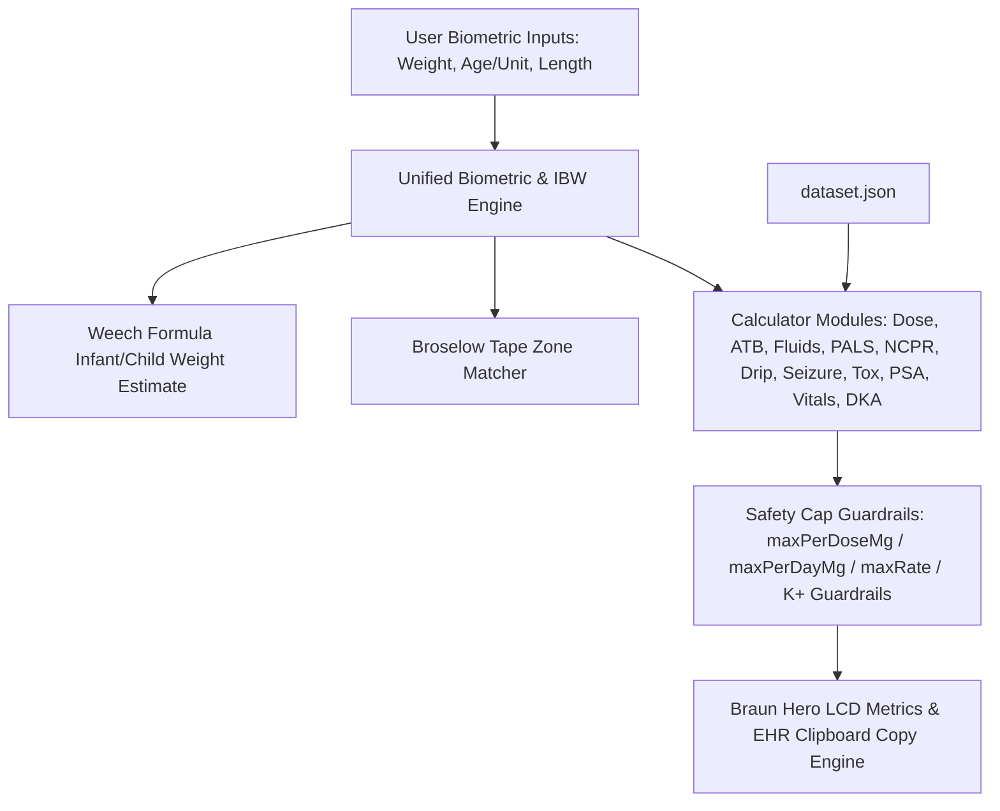

# System Architecture — MNRH ER-PED Calculator (`er-ped`)

## Components
1. **Top Navigation & Three-Zone Biometric Cluster (Measured / Derived / In Use)**:
   - `Measured` group — clinician-entered values only, never programmatically overwritten: `BW` (measured body weight in kg), `Age` + `Unit Switch` (Years/Months, Weech formula: `<1 yr`: `(mo + 9) / 2`, `1–6 yr`: `2 × age + 8`, `>6 yr`: `(7 × age - 5) / 2`), `HT` (length in cm, always enabled).
   - `Derived` group — read-only computed output: `Wt for Ht` value from Weight-for-Height Broselow tape bands, its `Wt-for-Ht` provenance tag, and the explicit `use for dosing` opt-in toggle.
   - `In Use` group (`#activeWeightBox`) — right-aligned, largest type in the topbar. States the weight the dose engine is actually running on plus its provenance and originating input: `measured BW`, `Wt for Ht · Wt-for-Ht 100 cm`, `estimated · Weech 4 yr`, or `enter BW or age` when unresolvable.
   - `Minimalist Centered Topbar & Right Action Cluster`: Minimal topbar layout without ER-PED brand badge clutter. Centered cluster houses patient inputs (`ABW`, `Age`, `HT`, `Wt for Ht` switch & display). Right-aligned cluster (`margin-left: auto`) houses reference tools & actions (`Broselow` tape chip, `Reference 📖▾` icon popover, `Print`, `TH/EN` language, `Dark/Light` theme toggle). Main tab bar explicitly splits into Row 1 (`Dose`, `ATB`, `IV Fluids`, `PALS`, `NCPR`, `Drip Rate`) and Row 2 (`Seizure`, `Toxicology`, `Sedation`, `Vitals`, `DKA`).
   - `Language & Print Cluster`: Topbar buttons for Thai/English UI switching (`🌐 TH` / `🌐 EN`) and 1-page reference card printing (`🖨️ Print`).

2. **Core Calculators & Search Interfaces**:
   - `Pediatric Dose`: General pediatric medication dosing with integrated Braun Combobox search, preparation concentration parsing (mg/mL, mg/tab), range checks, per-dose & per-day caps.
   - `Pediatric ATB`: Antibiotic dosing calculator per kg per day or per dose with Braun Combobox search, unit conversions, limits, age & weight warnings.
   - `IV Fluids`: Dehydration assessment (Mild 3–5%, Moderate 6–9%, Severe ≥10%), Holliday–Segar maintenance fluid rate calculation, deficit replacement over 24h/48h, ORS vs IV fluid plans.
   - `PALS`: Emergency cardiac arrest protocols (Epi, Amiodarone, Lidocaine, Defib), Bradycardia, Tachycardia (Adenosine, Sync Cardioversion), Torsades MgSO4, rendered with Braun Hero LCD Metric cards.
   - `NCPR`: Neonatal resuscitation protocols, Epinephrine IV/IO & ETT dosing, Volume expanders, PPV & FiO2 targets, Hypoglycemia D10W bolus & infusion, ETT & suction catheter sizing.
   - `Drip Rate`: Vasoactive continuous infusion calculator (mcg/kg/min → mL/hr) for Epinephrine, Norepinephrine, Dopamine, Dobutamine, Midazolam, Milrinone with customizable diluent volume.
   - `Seizure Protocol`: Time-phased status epilepticus pathway (0-5m, 5-10m, 10-20m, 20-40m) with weight-based 1st/2nd line ASMs & max cap guardrails.
   - `Toxicology`: Antidote dosing and overdose protocols (Naloxone, Flumazenil, Atropine OP, Activated Charcoal, NAC 3-bag regime).
   - `Sedation (PSA)`: Procedural sedation & analgesia (Ketamine IV/IM, Fentanyl IN/IV, Midazolam IN) with weight-based dosing and safety caps.
   - `Vital Signs`: Age-banded physiological normal ranges (HR, RR, Systolic/Diastolic BP, SpO2) and hypotension cutoffs.
   - `DKA Protocol`: Pediatric DKA fluid management (48h deficit - prior bolus), Regular Insulin drip (0.05-0.1 U/kg/hr), BG < 250 D5W switch alerts, and K+ replacement safety rules.

3. **Data Storage, EHR Copy & PWA Service**:
   - `dataset.json`: Single source of truth for drug references, Broselow bands, fluid rules, PALS, NCPR, Drips, Seizure, Toxicology, PSA, Vital Signs, and DKA protocols.
   - `EHR Copy Engine`: Formats clean, standardized medical English order lines with one-click clipboard copying (`[ER-PED DKA] IV 0.9% NS @ 91.7 mL/hr | Regular Insulin Drip @ 2.0 mL/hr [BW: 20.0 kg]`).
   - `sw.js` & `manifest.webmanifest`: Offline-first caching strategy with floating update notification banner (`#pwaUpdateBanner`).
   - `.github/workflows/ci.yml`: GitHub Actions automated dataset validation and core unit testing pipeline.

## Data Flow

## Key Decisions
1. **Braun Industrial Layout & Standalone Architecture** *(superseded palette — see Key Decision #32)*: Standalone clinical web app, originally styled with Braun industrial controls (warm chassis `#F5F4F0`, signal orange `#D9480F`), now on warm ivory (`#F0EEE6`) with muted clay accent (`#A8452A`) and high-contrast graphite ink per Key Decision #32; layout/control conventions (segmented tabs, hero metrics, inset panels) unchanged, without cross-links to external tools.
2. **Single Source of Truth for Weight**: `getWeight()` resolves one authoritative weight, and `getWeightSourceLabel()` resolves its provenance. Both are pushed to all module badges (`doseWBadge`, `atbWBadge`, `fWBadge`, `pWBadge`, `dripWBadge`, `seizureWBadge`, `toxWBadge`, `psaWBadge`, `vitalsWBadge`, `dkaWBadge`) as `20.0 kg`, `16.5 kg · Wt for Ht`, or `16.0 kg · est`, ensuring zero discrepancy during high-stress resuscitations.
3. **Integrated Autocomplete Combobox**: Unified drug search and selection component providing instant keyboard-driven search (`ArrowUp`/`ArrowDown`/`Enter`/`Esc`) and category tagging.
4. **EHR Order Engine Retained Without UI Surface**: `copyEHROrder()` and `copyCustomOrder()` remain implemented, exported, and covered by 7 JSDOM tests, but every in-card `Copy` button was removed. The workstation is optimised for reading clinical values at the bedside; order-copy controls consumed roughly a third of each card's height for a workflow not used in practice. Re-exposing copy is a UI-only change — the formatter and its regression coverage are intact.
5. **Offline-First PWA**: Service worker caches static assets (`index.html`, `app.js`, `dataset.json`) with cache-first strategy for static assets and stale-while-revalidate for `dataset.json` (clinical data). Auto-update check every 30 minutes with floating update notification banner (`#pwaUpdateBanner`).
6. **No External Framework Dependencies**: Pure Vanilla JS + CSS to minimize bundle size, eliminate build step complexity, and ensure high reliability.
7. **Non-Destructive Biometric Inputs & Compute/Adopt Separation**: Wt for Ht is COMPUTED whenever `HT > 0` and merely DISPLAYED; the `use for dosing` toggle governs only whether the dose engine ADOPTS it. `updateBiometricUIState()` never writes Wt for Ht back into the `#weight` field — overwriting a clinician's measured weight in place is silent data loss. `HT` is always enabled (a measured biometric, not a mode) and is never cleared by toggling Wt for Ht, entering BW, or entering Age. Entering BW or Age still releases the dose engine from Wt for Ht, but the height reading and Wt for Ht readout survive for comparison.
8. **Bidirectional Age Sync Engine**: Topbar age input and PALS card age input maintain continuous two-way state synchronization, ensuring immediate Weech weight estimation, accurate ETT sizing, and resuscitation dosing across all tabs.
9. **Explicit Active Weight Provenance**: `gWeightSource` tracks whether weight originates from manual measured entry (`'manual'`) or Weech age-based estimation (`'estimated'`). Manual weights are protected from silent overwrite when editing age, with a toast explaining why. `getWeightSourceLabel()` renders the provenance in the `In Use` box together with the originating input value (`estimated · Weech 4 yr`, `Wt for Ht · Wt-for-Ht 100 cm`) so a clinician can audit the number without hunting for another field. Module badges carry the compact suffix (`· Wt for Ht`, `· est`); a measured weight carries no suffix. The box is colour- AND text-differentiated (accent = measured, warning = derived, neutral = empty) to satisfy the monochrome constraint in Key Decision #28.
10. **Robust Clinical Frequency Parser & Composite Token Handling**: `dosesPerDayFromFreq` evaluates regex patterns for `qXh`, `qX-Yh`, `bid`, `tid`, `qid`, `OD`/`once daily`, and `div N`, resolving composite frequencies (e.g. `bid/tid`) to the lower, safer frequency multiplier without returning `null`.
11. **Table-Specific Dosing Semantics & Single-Dose Preservation**: `pediatricATB` numeric fields (`doseMinMgPerKg`/`doseMaxMgPerKg`) are stored as per-dose values directly (verified against clinical notes). Unlike `pediatricDose` (which stores daily totals for `perDay`), `calcATB` and `copyEHROrder('atb')` treat these numeric fields as per-dose targets to prevent clinical underdosing.
12. **Combobox Keyboard Navigation & WAI-ARIA Accessibility**: Search inputs feature full arrow-key (`ArrowUp`/`ArrowDown`), `Enter` selection, and `Escape` dismissal with active option scrolling (`.kb-active`) and screen-reader accessibility tags (`role="combobox"`, `role="listbox"`, `role="option"`, `aria-expanded`).
13. **Automated Dataset Self-Check Tooling**: `scripts/check-dataset.js` validates dataset integrity, checking per-dose vs per-day unit semantics, max daily limits against note text, and verifying 100% schema synchronization between `dataset.json` and `dataset.js`.
14. **Unambiguous Phenytoin Loading vs Maintenance Split**: Phenytoin is structured into two dedicated clinical entries (`phenytoin-iv-load` and `phenytoin-iv-maint`) to prevent single-dose 20 mg/kg loading doses from being multiplied by daily maintenance frequencies.
15. **Age-Gated Weight/Dose Banding Engine**: Dosing brackets (e.g. Oseltamivir, Nystatin, Albendazole) support `fixedDose` and `doseBands` with mandatory age-gating (`minAgeYr: 1.0` for Oseltamivir, 3-tier age/weight gating for Nystatin) to prevent catastrophic 10x overdose in infants under 1 year old.
16. **Recently Used Favorites Engine**: Combobox dropdowns track recently selected drug keys in `localStorage` (`er_ped_recent_doses` / `er_ped_recent_atbs`) and render a top `⭐️ RECENTLY USED` category section when search input is empty.
17. **Renal Dose Adjustment Warning Badges**: High-risk renal clearance agents (Aminoglycosides, Vancomycin, Fluoroquinolones, Acyclovir, Carbapenems) contain `renalAdjust: true` flags, rendering prominent amber `⚠️ ปรับขนาดยาตาม CrCl / eGFR` warnings in metric cards and prescribing directives.
18. **Braun Warm Dark Theme & Grayscale Luminance-Ordered Palette**: Pure CSS custom property theme engine supporting `prefers-color-scheme: dark` and header toggle (`🌙 Dark` / `☀️ Light`) with persistent state in `localStorage` (`er_ped_theme`). Built on zero-blue-cast warm charcoal background (`#171613`), non-glare off-white ink (`#EAE5DB`), and strictly escalating relative luminance ordering (`blue` < `good` < `warning` < `danger`) to guarantee clinical priority discernment on monochrome/grayscale monitors without color halation.
19. **Continuous Infusion Drip Calculation Engine**: Computes infusion pump rates (`mL/hr`) based on `mcg/kg/min`, patient weight (`ABW`), and preparation concentration (`mg in mL`), providing clinical diluent presets (e.g. 1 mg/50 mL, 150 mg/50 mL) and editable concentration fields with rate overflow alerts.
20. **Time-Phased Seizure & Antidote Protocol Pathway**: Timed resuscitation algorithms (0-5m, 5-10m, 10-20m, 20-40m) with automated per-dose calculation, max cap enforcement, and Flumazenil / Phenytoin D5W precipitation contraindication guardrails.
21. **Dual-Exposition Vital Signs Reference**: Renders age-banded normal physiological ranges (HR, RR, BP, SpO2) and hypotension cutoffs (`< 70 + 2×Age` mmHg) both as a standalone table card and as a dynamic inline topbar badge next to age input.
22. **Automated CI Validation & Unit Test Pipeline**: GitHub Actions workflow (`ci.yml`) runs dataset schema integrity validation (`check-dataset.js`) and mathematical unit tests (`test-core.js`) on every push/PR to prevent regression.
23. **Pediatric DKA Protocol Engine & Prior Bolus Subtraction**: Calculates 48-hour fluid deficit replacement subtracted by prior ER boluses, Regular Insulin drip rate (0.05–0.1 U/kg/hr), D5W switching at BG < 250 mg/dL, and potassium replacement safety directives.
24. **Bicultural UI Language Switcher (Thai / English)**: Dual-language header toggle (`🌐 TH` / `🌐 EN`) rendering bilingual labels while maintaining 100% Medical English in EHR order copy strings.
25. **Single-Page A4 Print Engine**: `@media print` hides interactive inputs, navigation chrome (`.tabs`), overlays, and floating controls, emitting only the ACTIVE tabpanel. Root cause of the previous 5-page output: `.card { display: block !important; }` overrode the inline `display:none` on the 10 inactive `section[role="tabpanel"]` elements, resurrecting every module at print time. Fixed by dropping the blanket `display:block` and adding explicit `section[role="tabpanel"][style*="display:none"] { display: none !important; }`, plus `@page { size: A4; margin: 10mm; }` and `break-inside: avoid` on `.hero-metric`/`tr`/`.summary`. Verified 2026-07-28: `chrome --headless --print-to-pdf` + `pdfinfo` → **1 page, 594.96 × 841.92 pts (A4)**, clinical content confirmed present via `pdftotext`.
26. **Lightweight Dataset Editor & Local Overrides**: Browser-based dataset customization drawer allowing clinicians to edit max caps and drug notes saved to `localStorage` with JSON export and master reset capability.
27. **Zero-Conflict Alt Shortcuts, Structured 2-Row Nav Layout, & Non-Disruptive Page Scrolling**: Navigation tab bar explicitly groups modules into 2 structured rows: Row 1 (Dose, ATB, IV Fluids, PALS, NCPR, Drip Rate) and Row 2 (Seizure, Toxicology, Sedation, Vitals, DKA). PALS tab auto-scrolling is disabled to maintain non-disruptive, top-of-page alignment across all tabs. Keyboard shortcuts remain mapped (`Alt+1`..`Alt+0`, `Alt+K`), preserving instant clinician navigation.
28. **Monochrome Palette & Portrait ED Display Optimization**: Enforces luminance-ordered theme via CSS custom properties on grayscale/monochrome displays regardless of OS dark mode reporting. Hero metric labels feature shape-coded prefix symbols (`✓`, `▲`, `✕`, `ℹ`) via CSS `::before` pseudo-elements for non-color-dependent severity recognition. Dedicated portrait media query (`@media (orientation: portrait) and (min-width: 700px) and (max-width: 900px)`) folds topbar vertically, uses a 6-column grid (2-column hero metrics), 44px touch targets, 8px metric borders, and 16px base font size for distance viewing on ~800×1200 CSS px portrait ER display panels.
29. **Structured Laxative & Antacid Dosing with Safety Caps & Dual PEG Entries**: Alum milk suspension, Lactulose syrup, and Polyethylene Glycol (PEG) are structured into per-kg dose fields (`doseMinMgPerKg`/`doseMaxMgPerKg`) with per-dose (`maxPerDoseMg`) and daily (`maxPerDayMg`) safety caps. PEG (Forlax) is explicitly split into dedicated clinical entries (`peg-forlax-10g-sachet-disimpaction` and `peg-forlax-10g-sachet-maint`) to support both acute ED fecal disimpaction (`1 g/kg/day`) and outpatient maintenance (`0.5–1 g/kg/day`) without manual math risks.
30. **Design Mockup v2 Refinements & Mono Safety Indicators**: Resolves CSS syntax formatting and duplicate selector blocks in `design-mockup-v2.html`. Implements a dynamic mock drug dataset (`paracetamol`, `ibuprofen`, `amoxicillin`, `ondansetron`, `salbutamol`, `diazepam`) for quick-grid recalculations with interactive dose, volume, verification math, and EHR copy strings. Adds dedicated prototype placeholder screens for `Drip` (vasopressor infusion mockup) and `Vitals` (age-adjusted vital signs reference) to avoid tab mapping ambiguity. Enforces non-color-dependent visual safety in monochrome theme via text-style Unicode glyphs with VS15 selector (`\2713\FE0E` `✓`, `\25B2\FE0E` `▲`, `\2716\FE0E` `✕`) and double-border styling for `.tag.warn`, ensuring zero color emoji rendering and 100% hue-free presentation on monochrome ED panels.
31. **Design Mockup v2 Integration & PR#1 Quality Fixes**: Merges design tokens from `design-mockup-v2.html` into `index.html`. Expands theme engine to 3-state cycle (`Light` → `Dark` → `Mono`) with persistent state in `localStorage` (`er_ped_theme`) and real-time Broselow chip/swatch palette re-rendering. Implements 2-row topbar with decluttered `Reference 📖▾` popover and `⋯` Overflow menu (`Print` / `Language`). Consolidates Broselow color palette into a single authoritative dictionary (`BROSELOW_COLOR_MAP`). Removes duplicate `initTheme()` hoisting conflict and invalid `(monochrome)` media query. Groups navigation tabs into 2 visual `.tabs` rows within a single outer `role="tablist"` container (`Clinical Calculators & Protocols`) with explicit `Alt+1`..`Alt+0` + `Alt+K` keyboard shortcuts, `type="button"` attributes, complete WAI-ARIA tablist/tabpanel semantics (`role="tab"`, `role="tabpanel"`, `aria-selected`, `aria-controls`), and CSS `--blue` alias linked to `--accent2`.

32. **Anthropic-Derived Reading-First Design Language & Card Densification**: Palette moved to warm ivory (`--bg: #F0EEE6`, `--card: #FBFAF7`) with a muted clay accent (`--accent: #A8452A` light / `#DE9070` dark), replacing the higher-chroma signal orange. Drop shadows removed (`--shadow-1: none`, `.card`/`.hero-metric` flat) so borders alone carry hierarchy. Module headings (`h1`, `h2`) use a serif display face (`Newsreader`, `--font-display`) against the Sarabun body sans. Density is deliberately INVERTED from Anthropic's marketing-site whitespace: card padding `20px → 14px 16px`, hero-metric padding `12px 16px → 9px 12px`, hero grid gap `12px → 8px`, container widened `1040px → 1180px`. Rationale: the site's calm comes from removing elements, not from spacing them apart — a bedside clinical tool must maximise data per screen. Verified: all 11 cards above the fold at 1440×950, document height reduced 944px → 903px.

33. **Measured Topbar Clearance (`--topbar-h`)**: The fixed topbar's height varies from 135px (desktop) to 219px (portrait ED panel) as the biometric groups wrap. `syncTopbarHeight()` measures the bar via `ResizeObserver` (plus a `document.fonts.ready` pass, since webfonts land after first paint) and publishes `--topbar-h` on `:root`; every `.container` margin is `calc(var(--topbar-h, 140px) + 12px)`. Replaces hardcoded `98px`/`120px`/`130px` margins which occluded page content behind the topbar on EVERY viewport under 900px (measured overlap up to 155px). Portrait ED panels additionally use `flex: 1 1 auto` (2-up) rather than `1 1 100%` on `.bio-group`, cutting the topbar from 285px to 219px on an 800×1200 panel. Verified clear at 1440/1180/900/800/700/430/380px.

34. **Global Toggle Switch & WCAG 2.5.8 Hit Areas**: `.switch` styling is global rather than scoped to `.chip`, so the `use for dosing` control in the biometric cluster renders as a real slider (34×24px, pill track, clay fill when ON) instead of a native checkbox. The knob stays visually 18px while `padding` + `background-clip: content-box` extend the hit area to the 24px WCAG 2.5.8 minimum for gloved use; `.unit-toggle-btn` gets `min-height: 26px`. `.bio-use-toggle:has(.switch:checked)` recolours the label so active state is conveyed by weight and colour together, satisfying the monochrome constraint in Key Decision #28.
35. **15-Year Pediatric Age Ceiling Guardrail**: Enforces a strict maximum pediatric age ceiling of 15 years (180 months) across topbar biometrics, PALS inputs, Weech weight estimation, and vital signs reference. Inputs exceeding 15 years are auto-clamped with an explicit clinical toast alert (`จำกัดอายุสูงสุดไม่เกิน 15 ปี (Pediatric Limit 15 Years)`) to prevent accidental adult dosing calculations in a pediatric ER workstation.
36. **Monochrome High-Contrast Tonal Inversion Engine**: On monochrome hospital displays (`data-theme="mono"`), color hues are unavailable to signal active or focused states. Active controls (`.tab-btn.active`, `.pill.active`, `.btn-primary`) and search combobox selections (`.combobox-item:hover`, `.combobox-item.selected`, `.combobox-item.kb-active`) apply high-contrast tonal inversion (`#EAEAE6` bright background with `#121210` dark graphite text and `#FFFFFF` 2px outline), guaranteeing > 14:1 contrast ratio and eliminating low-contrast white-on-white text issues on hospital panels.
