# Research Report: Minimal Bedside Design & Dual-Mode Architecture (BASIC vs PRO) — ER-PED Platform

**Author**: Offline-First Clinical Tech Lead (ER/Critical Care)  
**Date**: August 2026  
**Status**: Comprehensive Research & Architectural Proposal  
**Target Domain**: Pediatric Emergency Medicine, Resuscitation & Mobile Clinical Decision Support  

---

## 1. Executive Summary & Clinical Problem Framing

In acute pediatric emergencies (cardiac arrest, status epilepticus, anaphylactic shock, acute respiratory failure, severe trauma), time-to-intervention is critical. A clinician operating at the bedside:
1. **Operates under extreme cognitive load** (calculating weight-based doses, selecting equipment sizes, checking dilutions while managing a deteriorating infant/child).
2. **Frequently holds a mobile device in one hand** (often gloved, standing at the stretcher or in a moving ambulance) while using the other hand to palpate a pulse, manage an airway, or draw medications.
3. **Needs immediate, actionable numbers ("เอาไปใช้เลย")**:
   - Exact dose in **mg/mcg**
   - Exact drawn volume in **mL** (based on available standard concentrations)
   - Exact route and push rate
   - Exact equipment size (ETT ID mm, lip depth cm, blade)
4. **Is actively hindered by visual noise**:
   - Multi-paragraph pathophysiological background
   - Complex nested diagnostic forms (e.g. 13-item Phoenix score or 12-item PRAM score when immediate epinephrine or bronchodilator is needed)
   - Lengthy elective/outpatient drug lists (e.g. stool softeners, iron supplements, multi-week prophylactic regimens)
   - Tiny input boxes requiring two hands or keyboard zooming

### The Dual-Mode Solution:
To balance **immediate emergency bedside action** with **comprehensive clinical decision support**, the ER-PED platform will transition into a **Dual-Mode System**:

| Dimension | ⚡ **BASIC Mode** (Bedside Emergency Fast-Track) | 💎 **PRO Mode** (Comprehensive Clinical Suite) |
| :--- | :--- | :--- |
| **Primary Persona** | ER Physician, Nurse, Resuscitation Team at Bedside | Pediatric Intensivist, Medical Resident, General Pediatrician, Clinical Pharmacist |
| **Target Device / Context** | Smartphone (One-handed gloved thumb use, high stress, <10s glance) | Desktop / Tablet / Smartphone (Workstation, rounds, detailed diagnosis, print orders) |
| **Information Density** | **Ultra-focused**: Bold numbers, exact mL, direct equipment sizes, zero explanatory fluff | **Exhaustive**: Full monographs, 19 modules, diagnostic algorithms, pathophysiology, references |
| **Medication Scope** | Curated **Top ~25 High-Yield Emergency Drugs & Resus Procedures** | Complete **80+ Drug Monographs + Full Antimicrobial Guide** |
| **Navigation & Layout** | Single-screen vertical flow with bottom thumb category chips + 1-tap weight presets | 19-tab horizontal rail, category jump bar, multi-column cards, interactive modals |
| **Clinical Text** | Stripped down to Drug + Indication + Dose/mL + Route + 1-line safe prep | Complete clinical notes, dosing intervals, organ adjustments, citations |

---

## 2. Clinical Emergency Ergonomics & One-Handed Mobile UX

### 2.1 The "Natural Thumb Zone" on Mobile Devices
Ergonomic research on handheld clinical devices demonstrates that in one-handed smartphone operation:
- **Bottom 40–50% of the screen**: **Natural Thumb Zone** (Easiest, zero-strain reach).
- **Middle 30% of the screen**: **Stretch Zone** (Requires thumb extension).
- **Top 20% of the screen**: **Hard-to-reach / Two-handed Zone**.

```
+-----------------------------------+
|  [⚡ BASIC | 💎 PRO]  Weight Chip  |  <-- Glanceable Topbar (Read-only summary)
+-----------------------------------+
|                                   |
|   EMERGENCY GLANCEABLE CARDS      |  <-- High-contrast Actionable Outputs
|   - Large Bold Dose (mL + mg)     |      (Scrolls smoothly under thumb)
|   - High-contrast Status Badges   |
|                                   |
+-----------------------------------+
|  [ -1 ] [ -5 ]  [ 10 kg ] [ +1 ]  |  <-- Thumb Stepper & Quick Weight Selector
+-----------------------------------+
|  [🚨PALS] [🫁Airway] [⚡Seiz] [💊Meds] |  <-- Sticky Bottom Category Thumb Dock (>= 48px)
+-----------------------------------+
```

### 2.2 Core Interaction Principles for BASIC Mode
1. **Zero-Click Immediate Output**:
   - Tapping a weight preset (e.g. `10k`) instantly recalculates and displays all core emergency cards without requiring the user to open a dropdown or press "Calculate".
2. **Shape & Color Dual-Channel Coding**:
   - `🚨 Resuscitation / PALS`: High-visibility Crimson (`#DC2626` / `#FF2B2B`)
   - `🫁 Airway & Equipment`: Amber / Warm Ochre (`#B45309` / `#FBBF24`)
   - `⚡ Seizure Rescue`: Violet / Purple (`#7C3AED` / `#A78BFA`)
   - `🐝 Allergy & Anaphylaxis`: Coral / Terracotta (`#9E3D24` / `#E28E70`)
   - `💊 Common Acute Meds`: Clinical Emerald (`#15803D` / `#4ADE80`)
   - `💧 Fluids & Vitals`: Ocean Cyan (`#0284C7` / `#38BDF8`)
3. **Hero Output Format**:
   - Instead of generic text `Dose: 0.01 mg/kg`, the card heroically highlights:
     $$\mathbf{1.0\text{ mL}}\text{ IV push (1:10,000 / }0.1\text{ mg)}$$
   - Eliminates mental math and syringe conversion errors during code blue.
4. **Touch Target Accessibility**:
   - All interactive thumb controls strictly meet or exceed **WCAG 2.2 SC 2.5.8 ($\ge 48 \times 48\text{ px}$)** with physical active scale compression (`:active { transform: scale(0.96); }`).

---

## 3. Clinical Curation: Drug & Module Partitioning Matrix

### 3.1 What Gets Kept in BASIC Mode (The 25 High-Yield Essentials)

```mermaid
graph TD
    A[Patient Weight Selected] --> B[⚡ BASIC Mode Engine]
    B --> C1[🚨 Resus & PALS]
    B --> C2[🫁 Airway & RSI]
    B --> C3[⚡ Seizure Rescue]
    B --> C4[🐝 Anaphylaxis & Asthma]
    B --> C5[💊 Fast Bedside Meds]
    B --> C6[💧 Fluid Bolus & Maint]

    C1 --> D1[Adrenaline 1:10,000 IV]
    C1 --> D2[Defibrillation 2-4 J/kg]
    C1 --> D3[Amiodarone 5 mg/kg]
    C1 --> D4[Atropine 0.02 mg/kg]
    C1 --> D5[Adenosine 0.1-0.2 mg/kg]
    C1 --> D6[D10W Bolus 2 mL/kg]

    C2 --> E1[ETT Cuffed / Uncuffed + Depth]
    C2 --> E2[Blade Miller/Mac + Suction]
    C2 --> E3[Ketamine 1.5-2 mg/kg]
    C2 --> E4[Rocuronium 1 mg/kg + Sugammadex]

    C3 --> F1[Midazolam IV/IM/IN]
    C3 --> F2[Diazepam IV/Rectal]
    C3 --> F3[Levetiracetam Keppra 60 mg/kg]

    C4 --> G1[Adrenaline 1:1,000 IM Thigh]
    C4 --> G2[Salbutamol Nebulizer]
    C4 --> G3[Dexamethasone 0.6 mg/kg]

    C5 --> H1[Paracetamol Syrup & IV]
    C5 --> H2[Ibuprofen Syrup]
    C5 --> H3[Ondansetron IV/PO]
    C5 --> H4[Ceftriaxone 1st Dose IV]
    C5 --> H5[Morphine / Fentanyl IV]

    C6 --> I1[Shock Bolus 20 mL/kg NSS]
    C6 --> I2[Holliday-Segar Maint mL/hr]
```



### 3.2 Detailed Clinical Specifications for BASIC Core Items

| Domain | Item / Procedure | Formula / Standard Preparation | Bedside Action Output (e.g. 10 kg Child) | Safety Cap / Clinical Rule |
| :--- | :--- | :--- | :--- | :--- |
| **PALS** | **Adrenaline (Epi) IV/IO** | $0.01\text{ mg/kg}$ of 1:10,000 ($0.1\text{ mL/kg}$) | **`1.0 mL`** IV push q3–5m | Max $1\text{ mg}$ ($10\text{ mL}$) |
| **PALS** | **Defibrillation (VF/pVT)** | Initial $2\text{ J/kg}$ ➔ Refractory $4\text{ J/kg}$ | **`20 J`** ➔ **`40 J`** (Biphasic) | Max $10\text{ J/kg}$ or adult $200\text{ J}$ |
| **PALS** | **Synchronized Cardioversion** | $0.5\text{–}1.0\text{ J/kg}$ ➔ $2.0\text{ J/kg}$ | **`5–10 J`** ➔ **`20 J`** | Sync mode on monitor |
| **PALS** | **Amiodarone IV/IO** | $5\text{ mg/kg}$ rapid push | **`50 mg`** ($1.0\text{ mL}$ of $50\text{ mg/mL}$) | Max $300\text{ mg}$ / dose |
| **PALS** | **Atropine IV/IO** | $0.02\text{ mg/kg}$ | **`0.2 mg`** ($0.33\text{ mL}$ of $0.6\text{ mg/mL}$) | Min $0.1\text{ mg}$, Max child $0.5\text{ mg}$, adol $1.0\text{ mg}$ |
| **PALS** | **Adenosine IV (Rapid Push)** | 1st $0.1\text{ mg/kg}$ ➔ 2nd $0.2\text{ mg/kg}$ | **`1.0 mg`** ➔ **`2.0 mg`** (Rapid push + flush) | Max 1st $6\text{ mg}$, 2nd $12\text{ mg}$ |
| **PALS / Hypo** | **D10W IV Bolus** | $2\text{ mL/kg}$ ($0.2\text{ g/kg}$) IV push | **`20 mL`** D10W IV push | Recheck glucose in 15 min |
| **Airway** | **ETT Size (Cuffed)** | $\frac{\text{Age}}{4} + 3.5\text{ mm}$ (ID) | **`4.0 mm`** (Cuffed) | Keep 0.5 size above/below ready |
| **Airway** | **ETT Depth (at lip)** | $\text{Size} \times 3\text{ cm}$ (or $\frac{\text{Age}}{2} + 12$) | **`12.0 cm`** at dental arch / lip | Confirm bilateral breath sounds |
| **Airway** | **Laryngoscope Blade** | Age/weight based (Miller vs Mac) | **Miller 1 / Mac 2** | Suction: $\text{Size} \times 2 = 8\text{ Fr}$ |
| **Airway / RSI** | **Ketamine IV** | $1.5\text{–}2.0\text{ mg/kg}$ | **`15–20 mg`** ($0.3–0.4\text{ mL}$ of $50\text{ mg/mL}$) | Max $200\text{ mg}$ |
| **Airway / RSI** | **Rocuronium IV** | $1.0\text{–}1.2\text{ mg/kg}$ | **`10–12 mg`** ($1.0–1.2\text{ mL}$ of $10\text{ mg/mL}$) | Max $100\text{ mg}$ |
| **Airway / RSI** | **Sugammadex IV** | $16\text{ mg/kg}$ (CICO rescue) | **`160 mg`** ($1.6\text{ mL}$ of $100\text{ mg/mL}$) | Immediate Rocuronium reversal |
| **Seizure** | **Midazolam IV/IO** | $0.1\text{–}0.2\text{ mg/kg}$ | **`1.0–2.0 mg`** ($0.2–0.4\text{ mL}$ of $5\text{ mg/mL}$) | Max $5\text{ mg}$ |
| **Seizure** | **Midazolam IN / Buccal / IM** | $0.2\text{–}0.3\text{ mg/kg}$ | **`2.0–3.0 mg`** ($0.4–0.6\text{ mL}$ of $5\text{ mg/mL}$) | Max $10\text{ mg}$ |
| **Seizure** | **Diazepam Rectal / IV** | $0.2\text{–}0.3\text{ mg/kg}$ (Rectal $0.5\text{ mg/kg}$) | **`2.0–3.0 mg`** IV ($0.4–0.6\text{ mL}$) | Max $10\text{ mg}$ |
| **Seizure** | **Levetiracetam (Keppra) IV** | $60\text{ mg/kg}$ in NS over 10 min | **`600 mg`** ($6.0\text{ mL}$ of $100\text{ mg/mL}$) | Max $4500\text{ mg}$ |
| **Anaphylaxis** | **Adrenaline 1:1,000 IM** | $0.01\text{ mg/kg} = 0.01\text{ mL/kg}$ IM thigh | **`0.10 mL`** ($0.1\text{ mg}$) IM thigh | Max child $0.3\text{ mL}$, adol $0.5\text{ mL}$ |
| **Asthma** | **Salbutamol Nebulization** | $<20\text{ kg} \to 2.5\text{ mg}$; $\ge 20\text{ kg} \to 5\text{ mg}$ | **`2.5 mg`** ($0.5\text{ mL}$ in $3\text{ mL}$ NS neb) | Repeat q20m x 3 doses |
| **Croup / Asthma** | **Dexamethasone PO/IV** | $0.6\text{ mg/kg}$ single dose | **`6.0 mg`** ($1.5\text{ mL}$ of $4\text{ mg/mL}$) | Max $10\text{–}16\text{ mg}$ |
| **Meds** | **Paracetamol Syrup (250 mg/5 mL)** | $10\text{–}15\text{ mg/kg}$ PO q4–6h PRN | **`150 mg`** (**`3.0 mL`**) PO q 6 hr PRN | Max $1000\text{ mg/dose}$, $4000\text{ mg/day}$ |
| **Meds** | **Paracetamol IV (10 mg/mL)** | $15\text{ mg/kg}$ IV over 15 min | **`150 mg`** (**`15.0 mL`**) IV | Max $1000\text{ mg/dose}$ |
| **Meds** | **Ibuprofen Syrup (100 mg/5 mL)** | $10\text{–}15\text{ mg/kg}$ PO q6–8h | **`100 mg`** (**`5.0 mL`**) PO q 8 hr | Max $400\text{ mg/dose}$, $40\text{ mg/kg/day}$ |
| **Meds** | **Ondansetron IV/PO** | $0.15\text{ mg/kg}$ | **`1.5 mg`** ($0.75\text{ mL}$ of $4\text{ mg/2 mL}$) | Max $4\text{–}8\text{ mg}$ |
| **Meds** | **Ceftriaxone IV (1st Dose)** | $50\text{–}100\text{ mg/kg}$ IV over 30 min | **`500–1000 mg`** IV | Max $2000\text{ mg}$ |
| **Fluids** | **Shock Fluid Bolus** | $20\text{ mL/kg}$ isotonic crystalloid | **`200 mL`** NSS/Acetar push over 15m | Repeat up to 40–60 mL/kg if shock |
| **Fluids** | **Holliday-Segar Maintenance** | 4-2-1 rule | **`40 mL/hr`** ($1000\text{ mL/day}$) | D5/0.45% NaCl + KCl 20 mEq/L |

### 3.3 What Stays in PRO Mode Only
The following 13+ modules and deep diagnostic workflows are preserved exclusively in **PRO Mode**:
1. **Full Pediatric Dose Search**: 80+ outpatient/inpatient drugs (Alum milk, Lactulose, PEG, Domperidone, Cetirizine, Loratadine, Ferrous, Multivitamins, etc.).
2. **Pediatric Antimicrobial (ATB) Guide**: Full monographs (Meropenem, Vancomycin with trough levels, Colistin, Amikacin, Co-trimoxazole, Ciprofloxacin, Acyclovir, Oseltamivir, etc.).
3. **5-Section Pediatric Electrolytes & Acid-Base Engine**: Corrected Na/Ca, Osmolar Gap, Anion Gap, Delta Ratio, FeNa, FeUrea, UAG, TTKG, 48-hr Free Water Deficit combined pump rates, Bicarbonate deficit 50% initial resuscitation, and 4C emergency crisis protocols.
4. **Pediatric DKA Protocol Engine**: 2-bag system, ISPAD 2024 algorithms, regular insulin rate titration, dynamic D5/D10 dextrose warnings.
5. **Continuous Vasoactive Infusion Calculator (Drip)**: Drip recipes (Dopamine, Dobutamine, Norepinephrine, Epinephrine, Milrinone, Nicardipine) with pump rate in mL/hr and concentration overrides.
6. **Full Sepsis Engine**: Phoenix Sepsis Score (13-point multi-organ scoring) vs Simplified Checklist, SSC 2026 1-Hour Bundle.
7. **Procedural Sedation & Analgesia (PSA)**: Multi-agent combinations, Ramsay sedation scale, fasting times, discharge criteria.
8. **Toxicology & Antidotes**: Rumack-Matthew Paracetamol nomogram & NAC 21-hr protocol, Naloxone continuous drip, Deferoxamine, Atropine/Pralidoxime protocol for organophosphates.
9. **Trauma & Burns**: ATLS 11th Ed xABCDE primary survey checklists, Modified Parkland burn fluid formula with 8h/16h breakdown, EBV calculations.
10. **Croup & Stridor Protocol**: Full Westley 17-point score breakdown, rebound observation algorithms.
11. **Blood Transfusion**: SAGM vs CPDA-1 PRBC volume calculation, Platelets/FFP/Cryo dosing, Massive Transfusion Protocol (1:1:1) + Tranexamic Acid.
12. **WHO Growth Z-Score Engine**: WAZ & HAZ percentiles with Boy/Girl toggles.
13. **CDS Transparency & Clinical Documentation**: "Show Math" expanders, in-card evidence citation badges, and offline Pocket Card / A4 printing.

---

## 4. Technical Architecture for the Dual-Mode Switcher

### 4.1 State Management & Persistence
- Global variable `gAppMode`: `'basic'` (default) or `'pro'`.
- Synchronized with `localStorage.getItem('er_ped_app_mode') || 'basic'`.
- When switching modes:
  - `setAppMode(mode)` updates the root DOM attribute `data-app-mode="basic|pro"`.
  - Seamlessly transitions using the native **View Transitions API** (`document.startViewTransition()`).
  - Hides/shows the respective UI containers without page reloading or data loss.

### 4.2 DOM Hierarchy Structure

```html
<!-- Root Header -->
<header class="topbar">
  <!-- Brand + Mode Switcher Capsule -->
  <div class="brand-group">
    <h1>ER-PED</h1>
    <div class="mode-switch-pill" role="radiogroup" aria-label="Application Mode">
      <button type="button" class="mode-btn active" data-mode="basic" onclick="setAppMode('basic')">⚡ BASIC</button>
      <button type="button" class="mode-btn" data-mode="pro" onclick="setAppMode('pro')">💎 PRO</button>
    </div>
  </div>
  <!-- Biometric Quick Capsule (Shared across both modes) -->
  ...
</header>

<!-- MODE 1: BASIC CONTAINER (Active by default) -->
<main id="basicModeContainer" class="basic-container" style="display:block;">
  <!-- 1-Tap Thumb Weight Stepper Strip -->
  <!-- Search / Quick Filter Bar -->
  <!-- Curated Emergency Cards Vertical Flow -->
  <!-- Sticky Bottom Thumb Category Dock -->
</main>

<!-- MODE 2: PRO CONTAINER (Full 19-module suite) -->
<main id="proModeContainer" class="pro-container" style="display:none;">
  <!-- Category Jump Bar -->
  <!-- 19-Tab Navigation Rail -->
  <!-- Tabpanel 1..19 Cards -->
  <!-- Modals & CDS Drawers -->
</main>
```

### 4.3 Performance & Zero Runtime Overhead
- Both modes share the exact same underlying clinical math functions (`calcPALS()`, `calcAirway()`, `calcDose()`, etc.) in `app.js`.
- No duplicate calculations or out-of-sync logic.
- 100% offline PWA, zero dependencies, zero build steps.

---

## 5. Comparative Benchmark with International Emergency Apps

| Feature | Broselow Tape (Physical) | PalmPED / Pedi Crisis | Handtevy Mobile | TenSixteen ER | **ER-PED BASIC Mode** |
| :--- | :--- | :--- | :--- | :--- | :--- |
| **One-Handed Thumb Ergonomics** | ❌ (Two-handed tape) | ⚠️ (Requires scrolling/menus) | ⚠️ (Dense tablet layout) | ⚠️ (Form-heavy) | ✅ **Full Thumb-Zone Optimization** |
| **Instant Actionable Volume (mL)** | ⚠️ (Only mg on tape) | ✅ (mL shown) | ✅ (mL shown) | ⚠️ (mg only) | ✅ **Hero mL + mg + Push Rate** |
| **Equipment Sizing at a Glance** | ✅ (Direct list) | ⚠️ (Separate tab) | ✅ (Direct list) | ⚠️ (Separate tab) | ✅ **Hero Airway Card with Cuffed/Uncuffed** |
| **Offline-First PWA (Zero Install)**| ❌ (Physical) | ❌ (App Store only) | ❌ (Enterprise cloud) | ❌ (Native app) | ✅ **100% Offline Browser / PWA** |
| **Dual-Mode (Basic ER / Pro CDS)** | ❌ (Static) | ❌ (Fixed) | ❌ (Fixed) | ❌ (Fixed) | ✅ **Instant 1-Tap Toggle** |

---

## 6. Implementation Roadmap & Verification Strategy

1. **Phase 1: Dual-Mode Infrastructure & State Management**
   - Implement `gAppMode` in `app.js` with `setAppMode()` and `localStorage` persistence.
   - Add the tactile `[ ⚡ BASIC | 💎 PRO ]` mode switch in the topbar and overflow menu.
   - Update CSS with `data-app-mode` tokens and layout rules.
2. **Phase 2: BASIC Mode UI & Curated Emergency Engine**
   - Construct `#basicModeContainer` with 1-tap quick weight chips, thumb stepper, and instant search.
   - Build high-contrast, clutter-free emergency cards for Resuscitation, Airway, Seizures, Anaphylaxis/Asthma, Bedside Meds, and Fluids.
   - Attach thumb category filter dock (`🚨 PALS`, `🫁 Airway`, `⚡ Seiz`, `🐝 Resp`, `💊 Meds`, `💧 Fluids`).
3. **Phase 3: Integration & Cross-Mode Biometric Sync**
   - Ensure patient weight, age, and sex seamlessly propagate between BASIC and PRO modes in real time without screen refresh.
4. **Phase 4: Automated Testing & Clinical Validation**
   - Add comprehensive JSDOM regression tests for BASIC mode rendering, quick-weight updates, mode switching, and dosage calculations.
   - Verify zero layout shift (CLS 0.00) and full WCAG 2.2 touch compliance ($\ge 48\text{ px}$).
