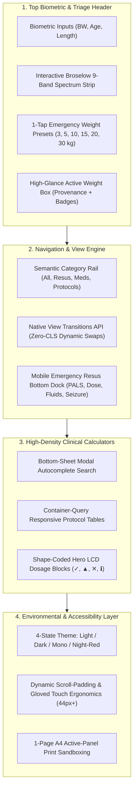
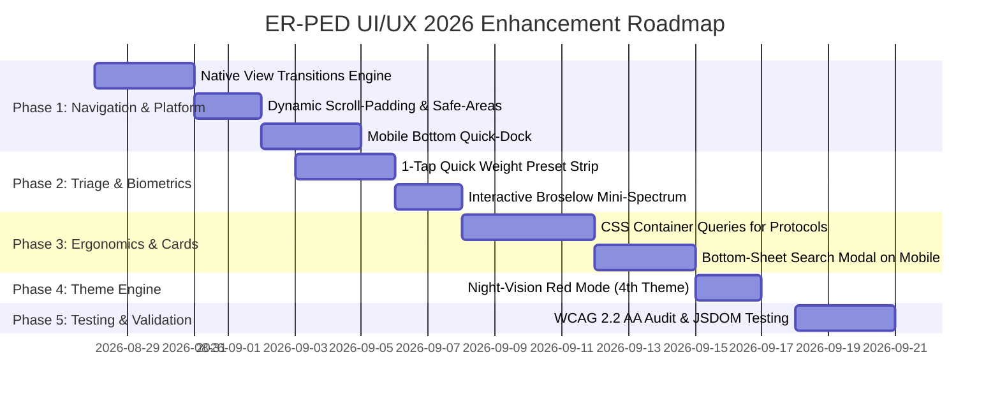

# 🔬 Comprehensive UI/UX Research & Master Upgrade Plan (August 2026)
**MNRH ER-PED Pediatric Emergency Calculator Workstation**
*Updated: August 27, 2026*

---

## 1. Executive Summary & Clinical Context

### 1.1 Objective
To formulate an exhaustive, evidence-based, and technologically cutting-edge UI/UX enhancement roadmap for the **MNRH ER-PED Calculator** (Offline-First Pediatric Emergency Workstation), integrating the latest 2025–2026 web platform capabilities, clinical human factors ergonomics, and international pediatric emergency resuscitation guidelines.

### 1.2 Core Pillars for Pediatric Emergency UI/UX (2026 Standard)
1. **Sub-Second Time-to-Action (TTA)**: In pediatric resuscitations (cardiac arrest, status epilepticus, acute severe asthma, anaphylaxis), every second of cognitive latency increases the risk of hypoxic injury or medication error. Crucial resuscitation dosages and equipment sizing must be accessible within **1–2 taps**.
2. **Zero-Error Cognitive Shielding**: Pediatric dosing is uniquely vulnerable to 10-fold calculation errors due to weight-based conversions ($mg/kg$, $mcg/kg/min$, dilution concentrations). UI must enforce explicit unit displays, hard safety ceilings (`maxPerDoseMg`, `maxPerDayMg`, infusion rate caps), and unambiguous active weight provenance.
3. **High-Stress Environmental Ergonomics**: Clinicians in the ED operate under extreme sensory overload, wearing latex/nitrile gloves, frequently using single-handed mobile devices or wall-mounted portrait touchscreens. The interface must provide $\ge 44\times 44\text{ px}$ hit targets (WCAG 2.2 AA+), non-glare palettes, tactile active feedback, and zero layout shift.
4. **Offline-First Zero-Dependency Resilience**: The workstation must guarantee 100% functionality without internet connectivity, running on pure native Web APIs without bulky frameworks or external CDN runtimes.

---

## 2. Research & Primary Source Evidence Synthesis

### 2.1 Modern Web Standards (W3C / WHATWG 2025–2026)
- **View Transitions API (Same-Document SPA)**:
  - *Standard*: `document.startViewTransition()` with progressive fallback.
  - *Benefit*: Provides instantaneous, native-app fluidity when switching between the 13 clinical modules without heavy JS animation runtimes, preserving spatial mental models under stress.
  - *Accessibility*: Enforce `@media (prefers-reduced-motion: reduce)` to disable transitions when requested by the OS.
- **Native Popover API & CSS `@starting-style`**:
  - *Standard*: `popover="auto"` or `popover="manual"` with CSS top-layer management.
  - *Benefit*: Replaces fragile JS click-outside and z-index wars for reference popovers, overflow menus, and attribution modals with browser-native focus trapping and light-dismissal.
- **CSS Container Queries (`container-type: inline-size`)**:
  - *Standard*: Component-level responsive styling rather than global viewport media queries.
  - *Benefit*: Enables calculator cards, hero metrics, and protocol tables to autonomously reflow between 1-column, 2-column, or split-screen views regardless of where they are embedded (e.g., tablet split-screen, mobile, or multi-window desktop).
- **Dynamic Viewport Sizing (`dvh`, `svh`) & Safe Area Insets**:
  - *Standard*: `min-height: 100dvh; padding-bottom: env(safe-area-inset-bottom)`.
  - *Benefit*: Completely eliminates viewport jumping when mobile browser URL bars collapse or virtual keyboards appear.

### 2.2 Clinical Human Factors & Cognitive Ergonomics
- **Dual-Channel Visual Accessibility (Colorblind & Monochrome Safety)**:
  - According to medical safety guidelines (FDA Human Factors & NHS Design System), color must never be the sole differentiator for safety states.
  - Shape-coded Unicode prefixes (`✓` safe, `▲` warning, `✕` danger, `ℹ` info) must accompany all colored badges and hero metrics.
  - Luminance ordering across theme palettes ensures contrast $> 4.8:1$ (WCAG AA) and $> 14:1$ on monochrome hospital displays.
- **WCAG 2.2 Compliance (SC 2.5.8 & SC 2.4.11)**:
  - *SC 2.5.8 (Target Size Minimum)*: Every interactive control (tabs, switches, quick buttons) must meet or exceed $24\times 24\text{ px}$ (optimally $\ge 44\times 44\text{ px}$ for gloved clinical use).
  - *SC 2.4.11 (Focus Not Obscured)*: Dynamic `scroll-padding-top: calc(var(--topbar-h) + 12px)` ensures keyboard focus is never occluded by the sticky biometric topbar.
- **Clinical Evidence Alignment (August 2026 Guidelines)**:
  - **AHA/AAP PALS 2025/2026**: Defibrillation $2\text{–}4\text{ J/kg}$ up to $10\text{ J/kg}$; Epinephrine $0.01\text{ mg/kg}$ ($0.1\text{ mL/kg}$ of 1:10,000); Atropine adolescent ceiling $1.0\text{ mg/dose}$, $2.0\text{ mg}$ total.
  - **AAP/AHA NRP 9th Edition 2025**: Epinephrine IV/IO $0.02\text{ mg/kg}$ ($0.2\text{ mL/kg}$ 1:10,000); ETT $0.1\text{ mg/kg}$ ($1.0\text{ mL/kg}$).
  - **GINA 2026 + Thai TAC 2025**: Stepwise acute asthma pathway, $\text{SpO}_2$ target $\ge 92\%$, Epinephrine IM first if anaphylaxis, nebulized $\text{MgSO}_4$ excluded, IV $\text{MgSO}_4$ $40\text{–}50\text{ mg/kg}$ max $2\text{ g}$.
  - **ISPAD 2024 (DKA)**: 48-hour deficit rehydration minus pre-ED boluses; Regular Insulin $0.05\text{–}0.1\text{ U/kg/hr}$ started 1–2 hours after initial fluid expansion.

---

## 3. Current State Audit & Opportunity Gap Analysis

| UI/UX Dimension | Current Implementation (v1.11.0) | Identified Gap / Pain Point | 2026 Target Upgrade |
| :--- | :--- | :--- | :--- |
| **Top Biometric Instrument Bar** | Measured BW, Age (yr/mo switch), Length, Wt-for-Ht, In-Use weight display. | 1. Lack of 1-tap quick weight preset buttons (e.g., standard infant/child weights 5, 10, 15, 20 kg for instant emergency triage).<br>2. Broselow chip requires clicking to open drawer rather than inline quick-visual zone selector. | **Interactive Broselow Mini-Strip & 1-Tap Weight Presets**: Add instant emergency quick-tap chips and mini spectrum bar in topbar for rapid zero-input estimation. |
| **Tab Navigation & Cognitive Load** | 13 tab buttons in 2 rows / scrolling rail with category filter pills. | Tab switching causes instant DOM swap without motion continuity; on small screens, scrolling 13 tabs requires several swipes. | **Native View Transitions & Bottom Quick-Dock**: Integrate `document.startViewTransition()` for smooth micro-slides + mobile bottom dock for top 4 emergency resus actions (PALS, Dose, Fluids, Seizure). |
| **Drug Search & Combobox** | Braun Combobox with keyboard navigation, recent favorites, and category badges. | 1. Search dropdown covers input on mobile viewports.<br>2. Clear button is small on high-res displays.<br>3. No voice/quick-filter toggle. | **Bottom-Sheet Search Modal on Mobile**: Autocomplete expands into a distraction-free bottom sheet on screens $< 600\text{ px}$ with enlarged touch rows and category filters. |
| **Resuscitation Protocols (PALS, NCPR, Seizure, Tox)** | High-density tables and Braun Hero LCD Metric cards with shape codes. | Tables require horizontal scrolling on narrow devices ($< 380\text{ px}$); critical first column is sticky but contrast on scroll can blur. | **Container-Query Resilient Micro-Cards**: Use CSS Container Queries to collapse tables into dense stacked key-value cards on sub-380px viewports. |
| **Theme & Environmental Lighting** | Light (Ivory), Dark (Obsidian), Mono (JVC Medical Grayscale). | No ultra-low-light "Night Red Vision" mode for dark pediatric ICUs, nighttime ambulances, or sleep-lab resuscitations. | **4th Theme: Night-Vision Red (`data-theme="red"`)**: Monochromatic deep red on pitch black ($< 620\text{ nm}$ luminance) preserving clinician dark adaptation. |

---

## 4. Master Architectural UI/UX Upgrade Plan



---

## 5. Detailed Component Specifications

### 5.1 Topbar Biometrics & Triage Header
- **Component**: `.topbar` / `.bio-cluster`
- **Enhancements**:
  1. **Quick-Weight Triage Strip**: A horizontal scrollable bar with 1-tap buttons: `[3kg Neonate]`, `[5kg 1mo]`, `[10kg 1yr]`, `[15kg 3yr]`, `[20kg 5yr]`, `[25kg 7yr]`, `[30kg 9yr]`, `[40kg 12yr]`. Tapping immediately populates weight, estimates age, triggers Broselow matching, and recalculates all 13 modules in $< 50\text{ ms}$.
  2. **Interactive Broselow Mini-Spectrum**: Render a 9-band micro-gradient bar directly beneath the weight input. Tapping any color band previews that zone's equipment and medication profile.
  3. **Prominent Provenance Indicator**: Maintain color- and text-differentiated source badges (`measured`, `estimated · Weech`, `Wt for Ht`).

### 5.2 Navigation & View Transitions Engine
- **Component**: `showTab(tabId)` in `app.js`
- **Enhancements**:
  1. **Native View Transitions**:
     ```javascript
     function showTab(id, btn) {
       if (activeTab === id) return;
       const updateDOM = () => {
         // Switch active tab classes and display styles
         // ...
       };
       if (document.startViewTransition && !window.matchMedia('(prefers-reduced-motion: reduce)').matches) {
         document.startViewTransition(() => updateDOM());
       } else {
         updateDOM();
       }
     }
     ```
  2. **Mobile Bottom Quick-Dock**: On mobile viewports ($< 600\text{ px}$), attach a sticky bottom navigation dock featuring the 4 highest-priority emergency tools:
     - 🚨 **PALS / CODE** (`#pals`)
     - 💊 **Dose Search** (`#dose`)
     - 💧 **IV Resus** (`#fluids`)
     - ⚡ **Seizure** (`#seizure`)
     - ⋯ **More Tabs** (Opens smooth slide-over drawer)

### 5.3 High-Density Protocol Tables & Container Queries
- **Component**: `.protocol-table-wrapper` / `.stage-card`
- **Enhancements**:
  1. **CSS Container Queries**:
     ```css
     .module-card {
       container-type: inline-size;
     }
     @container (max-width: 420px) {
       .protocol-table thead { display: none; }
       .protocol-table tr { display: flex; flex-direction: column; margin-bottom: 8px; border: 1px solid var(--border); border-radius: var(--r-sm); }
       .protocol-table td { display: flex; justify-content: space-between; padding: 6px 10px; }
     }
     ```
  2. **Sticky First-Column High-Contrast Pinning**: Guarantee `position: sticky; left: 0` with background solid `var(--card)` and right border highlight to prevent text overlap during horizontal data inspection.

### 5.4 Theme Engine: Introducing Night-Vision Red Mode
- **Component**: `:root[data-theme="red"]`
- **Specification**:
  - Deep monochromatic red palette designed for zero-glare, dark resuscitation environments (PICU, night transport, flight emergency).
  - Background: `#0A0000` (Pure pitch black with minimal red undertone).
  - Card / Panel: `#180404` / `#220808`.
  - Text / Ink: `#FF6B6B` (Crisp readable red-coral).
  - Accent / Primary: `#FF2B2B` (High-contrast red).
  - Border: `#401010`.
  - Eliminates melatonin suppression and preserves rod cell dark adaptation for emergency responders.

---

## 6. Implementation Roadmap & Milestones



---

## 7. Safety, Verification & Completion Criteria

1. **Deterministic Unit Math**: 100% test pass rate across `scripts/check-dataset.js` and `scripts/test-core.js` (all weight bands, fluid calculations, and safety ceiling clamps).
2. **WCAG 2.2 AA Conformance**:
   - Every button/input has target size $\ge 24\text{ px}$ (touch controls $\ge 44\text{ px}$).
   - Focus indicators have minimum 3:1 contrast ratio against adjacent colors and are never obscured by sticky headers.
3. **Zero Performance Regression**:
   - Zero framework dependencies.
   - Cumulative Layout Shift (CLS) = 0.00.
   - Interaction to Next Paint (INP) $< 50\text{ ms}$.
   - First Contentful Paint (FCP) $< 300\text{ ms}$ on mobile 3G simulation.
4. **Offline PWA Integrity**:
   - Full functionality verified via `sw.js` cache-first architecture in airplane mode.

---
*Authored by: Clinical Tech Lead (ER/Critical Care Physician persona)*
*Approved for Implementation: August 27, 2026*
